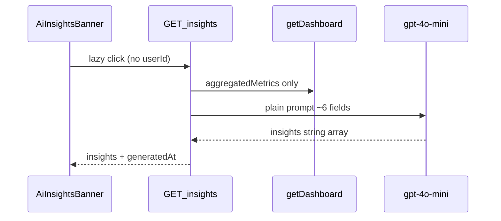
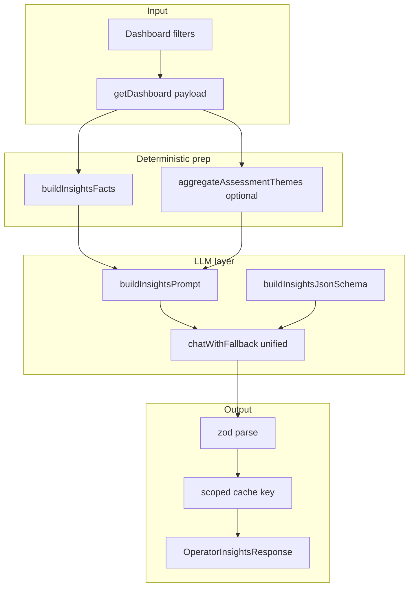

# План улучшения AI-инсайтов дашборда

## Текущее состояние (baseline)



**Ключевые файлы сегодня:**
- Backend: [`operator-analytics.service.ts`](c:/Users/Professional/WebstormProjects/aiPBX_backend/src/operator-analytics/operator-analytics.service.ts) (`getInsights`, `getProjectInsights`, in-memory cache)
- Controller: [`operator-analytics.controller.ts`](c:/Users/Professional/WebstormProjects/aiPBX_backend/src/operator-analytics/operator-analytics.controller.ts) — два эндпоинта: `GET /insights` и `GET /projects/:id/insights`
- Frontend: [`AiInsightsBanner.tsx`](c:/Users/Professional/WebstormProjects/aiPBX/src/features/OperatorAnalytics/ui/OperatorDashboard/AiInsightsBanner/AiInsightsBanner.tsx), RTK [`getOperatorInsights`](c:/Users/Professional/WebstormProjects/aiPBX/src/entities/Report/api/reportApi.ts)
- Дашборд-данные уже богаче промпта: `agentScorecards`, `timeSeries`, `customMetricsAggregated`, `excludedLowQualityCount`, `visibleDefaultMetrics` — но **не передаются в LLM**

**Известные дефекты:**
- `getProjectInsights` cache key без `userId` → утечка кэша между пользователями
- Admin UI не передаёт `userId` клиента в insights (dashboard передаёт)
- Два LLM-пути: `chatWithFallback` vs прямой `openAiClient`
- Нет тестов на insights
- `getProjectInsights` порог `totalAnalyzed === 0`, `getInsights` — `< 5` (несогласованность)

---

## Целевая архитектура



**Принципы (best practices):**
1. **Grounded generation** — LLM получает pre-computed facts (числа, топ/боттом метрики, outliers операторов, тренды); запрет на выдумывание данных
2. **Structured output** — каждый инсайт typed + evidence с metric/value
3. **Reason-before-recommendation** — observation отделён от recommendation (как в `_assessments`)
4. **Tenant-safe cache** — ключ включает `tenantUserId`, filters, `INSIGHTS_PROMPT_VERSION`
5. **On-demand billing** — сохраняем текущую модель (кнопка → списание)

---

## Фаза 1 — Backend: контракт и пайплайн

### 1.1 Новый модуль `insights-schema.ts`

Создать [`aiPBX_backend/src/operator-analytics/lib/insights-schema.ts`](c:/Users/Professional/WebstormProjects/aiPBX_backend/src/operator-analytics/lib/insights-schema.ts) по аналогии с [`analysis-schema.ts`](c:/Users/Professional/WebstormProjects/aiPBX_backend/src/operator-analytics/lib/analysis-schema.ts):

```typescript
export const INSIGHTS_PROMPT_VERSION = '2026-06-18.1';

export type InsightPriority = 'high' | 'medium' | 'low';
export type InsightType = 'strength' | 'gap' | 'trend' | 'outlier' | 'quality';

export interface OperatorInsight {
  priority: InsightPriority;
  type: InsightType;
  title: string;           // короткий заголовок, RU
  observation: string;     // что видим в данных, RU
  recommendation: string;  // конкретное действие, RU
  evidence: {
    metric?: string;       // greeting_quality | successRate | ...
    value?: number;
    operators?: string[];
    periodLabel?: string;
  };
}

export interface OperatorInsightsResponse {
  insights: OperatorInsight[];
  generatedAt: string;
  promptVersion: string;
  sampleSize: number;
  lowConfidence: boolean;  // true если n < OPERATOR_INSIGHTS_MIN_CALLS
  factsDigest?: string;    // hash/summary для cache invalidation debug
}
```

- Zod-схема + OpenAI `json_schema` (strict)
- `parseAndValidateInsightsResponse()` с fallback: если LLM вернул legacy `string[]` — обернуть в minimal `OperatorInsight` (BC на 1 релиз, затем удалить)

### 1.2 Deterministic facts builder

`buildInsightsFacts(dashboard, project?, query?)` → объект для промпта:

| Блок | Источник | Пример fact |
|---|---|---|
| `summary` | dashboard totals | avgScore=72.4, successRate=81%, n=47 |
| `metricRanking` | `aggregatedMetrics` | worst: greeting_quality=58; best: politeness=91 |
| `operatorOutliers` | `agentScorecards` | bottom: Иванов avg=54 (n=8); top: Петров avg=88 |
| `trends` | `timeSeries.daily/monthly` | avgScore week1=68 → week2=74 (+6) |
| `customMetrics` | `customMetricsAggregated` | upsell_attempt true=34% |
| `dataQuality` | `excludedLowQualityCount` | 3 записи исключены из агрегации |
| `focusMetrics` | `project.visibleDefaultMetrics` | только релевантные метрики проекта |
| `assessmentThemes` | `_assessments` rationales (Phase 1b) | top gaps: «не назвал клинику» ×12 |

**Period-over-period (optional в Phase 1):** второй вызов `getDashboard` на предыдущий равный интервал → deltas в facts. Если дорого по SQL — отложить в Phase 2, но заложить интерфейс `previousPeriod?: DashboardSnapshot`.

**Assessment themes (Phase 1b):** при `loadDashboardCdrPages` собрать rationales из `metrics._assessments` для метрик ниже 100; frequency count top-5 тем. Не отправлять сырые транскрипты — только агрегированные темы + count.

### 1.3 Prompt + guardrails

`buildInsightsPrompt(facts, projectContext)`:

- System: «Respond only in JSON. Use ONLY provided facts.»
- Rules:
  - 3–6 инсайтов, каждый с `evidence.metric` + `evidence.value` где применимо
  - Не давать generic advice без числа из facts
  - `lowConfidence=true` → добавить insight-type `quality` с caveat о малой выборке
  - Язык: Russian для title/observation/recommendation
  - При `operatorName` filter — фокус на одном операторе

### 1.4 Унификация сервиса

Рефакторинг [`operator-analytics.service.ts`](c:/Users/Professional/WebstormProjects/aiPBX_backend/src/operator-analytics/operator-analytics.service.ts):

- `private async generateInsights(ctx: InsightsGenerationContext)` — единая точка
- `getInsights` и `getProjectInsights` → thin wrappers (project endpoint deprecated или делегирует)
- Всегда `chatWithFallback` + `json_schema` + `temperature: 0`
- Единый порог: `OPERATOR_INSIGHTS_MIN_CALLS` (default **10**, env; UI `insightsAvailable` синхронизировать)
- Cache key:
  ```
  insights:v1:{tenantUserId}:{projectId}:{start}:{end}:{operator}:{promptVersion}:{factsDigest}
  ```
  где `tenantUserId = query.userId || realUserId || 'admin-all'`

### 1.5 Controller / API

Обновить [`operator-analytics.controller.ts`](c:/Users/Professional/WebstormProjects/aiPBX_backend/src/operator-analytics/operator-analytics.controller.ts):

- `GET /operator-analytics/insights` — принимает `userId` (admin), возвращает `OperatorInsightsResponse`
- `GET /projects/:id/insights` — пометить `@ApiDeprecated`, делегировать в `generateInsights` (убрать дублирование промпта)
- Swagger DTO для structured insight

### 1.6 Тесты backend

Новый [`insights-schema.spec.ts`](c:/Users/Professional/WebstormProjects/aiPBX_backend/src/operator-analytics/lib/insights-schema.spec.ts):
- `buildInsightsFacts` — ranking, outliers, lowConfidence flag
- zod validation structured payload
- cache key includes userId
- prompt contains guardrail phrases

Расширить [`operator-analytics.service.spec.ts`](c:/Users/Professional/WebstormProjects/aiPBX_backend/src/operator-analytics/operator-analytics.service.spec.ts):
- mock LLM → structured response
- billing вызывается
- cache hit/miss per tenant

### 1.7 Env + docs

Добавить в [`OPERATOR_ANALYTICS_ENV.md`](c:/Users/Professional/WebstormProjects/aiPBX_backend/docs/OPERATOR_ANALYTICS_ENV.md) и `.env.example`:

| Variable | Default | Purpose |
|---|---|---|
| `OPERATOR_INSIGHTS_MIN_CALLS` | `10` | Минимум звонков для генерации |
| `OPERATOR_INSIGHTS_TTL_SEC` | `3600` | TTL in-memory cache |
| `OPERATOR_INSIGHTS_MAX_COUNT` | `6` | Max insights in response |

---

## Фаза 2 — Frontend: structured UI

### 2.1 Типы и API

Обновить [`report.ts`](c:/Users/Professional/WebstormProjects/aiPBX/src/entities/Report/model/types/report.ts):

```typescript
export interface OperatorInsight { ... }
export interface OperatorInsightsResponse { ... }
```

Обновить [`reportApi.ts`](c:/Users/Professional/WebstormProjects/aiPBX/src/entities/Report/api/reportApi.ts) — новый response type; query params: `userId`, `startDate`, `endDate`, `projectId`, `operatorName`.

### 2.2 AiInsightsBanner redesign

[`AiInsightsBanner.tsx`](c:/Users/Professional/WebstormProjects/aiPBX/src/features/OperatorAnalytics/ui/OperatorDashboard/AiInsightsBanner/AiInsightsBanner.tsx):

- Props: добавить `userId` (admin), `operatorName?`
- **Reset state** при смене `queryParams` (useEffect → clear cached RTK result / local key)
- Кнопки: «Получить инсайты» + «Обновить» (force refetch, bypass cache via `?refresh=1` query param на backend)
- Карточка инсайта:
  - badge priority (high=red, medium=amber, low=gray)
  - type icon (strength/gap/trend/outlier)
  - title bold + observation + recommendation
  - evidence chip: `greeting_quality: 58` / операторы
- `lowConfidence` banner: «Мало данных (n=X), выводы предварительные»
- Error state: balance insufficient / LLM fail
- Loading skeleton per insight slot

Прокинуть `userId` из [`DashboardCallRecordsPage.tsx`](c:/Users/Professional/WebstormProjects/aiPBX/src/pages/DashboardCallRecordsPage/ui/DashboardCallRecordsPage/DashboardCallRecordsPage.tsx) → `OperatorDashboard` → `AiInsightsBanner` (как у `useGetOperatorDashboard`).

### 2.3 i18n

Добавить ключи в [`public/locales/*/reports.json`](c:/Users/Professional/WebstormProjects/aiPBX/public/locales/en/reports.json):
- priority labels, type labels, low confidence, refresh, error messages

### 2.4 SCSS

Расширить [`AiInsightsBanner.module.scss`](c:/Users/Professional/WebstormProjects/aiPBX/src/features/OperatorAnalytics/ui/OperatorDashboard/AiInsightsBanner/AiInsightsBanner.module.scss) — priority borders, evidence chips.

---

## Фаза 3 — Качество, eval, drill-down (follow-up)

### 3.1 Drill-down hooks (UI-ready evidence)

Evidence `operators[]` + `metric` → клик открывает CDR list с prefilled filters (`operatorName`, date range). Интеграция с существующим [`getOperatorCdrs`](c:/Users/Professional/WebstormProjects/aiPBX/src/entities/Report/api/reportApi.ts) — без нового backend.

### 3.2 Persist insights (optional)

Таблица `operator_insights_runs` (userId, projectId, filters hash, response JSON, promptVersion, tokens, cost) — для audit и сравнения версий промпта. Не блокирует Phase 1–2.

### 3.3 Redis cache (optional, multi-instance)

Заменить `Map` на Redis с тем же key format — когда >1 backend instance.

### 3.4 Offline eval

Golden fixtures в [`eval/golden-set/`](c:/Users/Professional/WebstormProjects/aiPBX_backend/src/operator-analytics/eval/golden-set/) с synthetic dashboard snapshots → expected insight themes (не exact match — rubric-based scoring: grounded? actionable? priority sane?).

---

## Миграция и обратная совместимость

| Aspect | Strategy |
|---|---|
| API response | Breaking change `string[]` → `OperatorInsight[]`; frontend обновляется в том же PR |
| `insightsAvailable` threshold | Backend + frontend sync на `OPERATOR_INSIGHTS_MIN_CALLS` |
| `/projects/:id/insights` | Deprecated wrapper, удалить в следующем milestone |
| Billing type `insight` | Без изменений |

---

## Критерии готовности (Definition of Done)

- [ ] LLM получает facts: scorecards, metric ranking, trends, custom metrics, data quality, focus metrics
- [ ] Structured JSON validated; hallucination guardrails в промпте
- [ ] Единый `chatWithFallback` path; `INSIGHTS_PROMPT_VERSION` на ответе
- [ ] Cache tenant-safe; admin `userId` корректен
- [ ] UI: priority badges, evidence, refresh, filter reset, lowConfidence warning
- [ ] Unit tests: schema + facts builder + service mocks
- [ ] Env docs updated

---

## Оценка объёма

| Фаза | Scope | Effort |
|---|---|---|
| **Phase 1** | Backend schema, facts, prompt, unify, tests, env | ~1.5–2 дня |
| **Phase 2** | Frontend types, banner redesign, i18n, userId wiring | ~1 день |
| **Phase 3** | Drill-down, persist, Redis, eval | ~1–2 дня (отдельный milestone) |

**Рекомендуемый первый PR:** Phase 1 + Phase 2 вместе (end-to-end structured insights).
