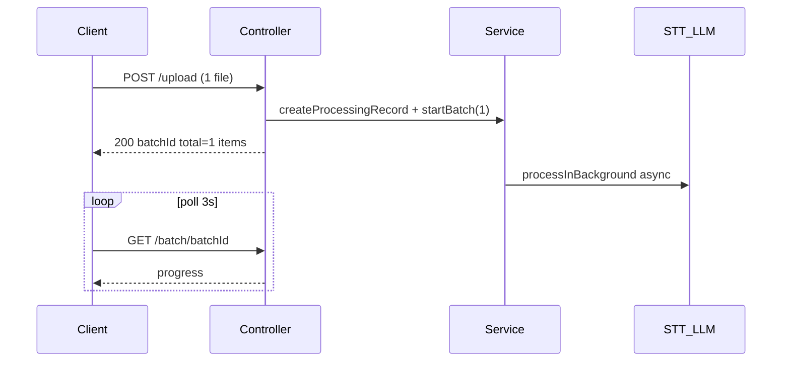

## OperatorAnalytics — исправления по результатам ревью

Порядок: безопасность → корректность кастомных метрик → агрегация на дашборде → прочее.

> **Сквозное требование (прод): обратная совместимость, ничего не ломать — только улучшать.**
> - Новые поля БД — `nullable`/с дефолтами; никаких переименований/удалений существующих колонок.
> - API — только аддитивные поля; формы ответов не ломать (старый фронт должен продолжать работать).
> - Изменение формата хранения (кастомные метрики, шифрование, `metric_values`) — через **dual-read** (читать и новый, и legacy-формат) и при необходимости dual-write; backfill — отдельными безопасными скриптами.
> - Крупные/поведенческие изменения — под фиче-флагом/env с безопасным дефолтом (выключено), чтобы прод-поведение не менялось до явного включения.
> - Разделы 1–7 — приоритетные багфиксы/качество; разделы 8–12 — последующие фазы (roadmap), внедрять инкрементально.

### 1. Закрыть `GET /operator-analytics/:id` (безопасность)
- В [aiPBX_backend/src/operator-analytics/operator-analytics.controller.ts](aiPBX_backend/src/operator-analytics/operator-analytics.controller.ts) у роута `@Get(':id')` (L623) сейчас нет guard. Глобально стоит только `ThrottlerGuard` ([app.module.ts](aiPBX_backend/src/app.module.ts):101).
- Добавить `@UseGuards(RolesGuard)` + `@Roles('ADMIN','USER')` (как у соседних JWT-роутов) либо `@UseGuards(JwtAuthGuard)`. После этого `req.vpbxUserId/tokenUserId` будет проставлен и `getById(+id, userId)` отфильтрует по владельцу. Проверить, что фронтовый `getOperatorAnalysis` (`/operator-analytics/:id`) шлёт Bearer.

### 2. Единое имя и рендер кастомных метрик
Сейчас 3 несовместимых имени: LLM возвращает `custom_metrics`, в БД пишется под ключ `metrics`, а `bulkMoveCdrs` ищет `custom_metrics`. Привести всё к `custom_metrics`.
- Backend [operator-analytics.service.ts](aiPBX_backend/src/operator-analytics/operator-analytics.service.ts): заменить `mergedMetrics = { ...metrics, metrics: customMetricsResult }` на `{ ...metrics, custom_metrics: customMetricsResult }` в трёх местах (`:298`, `:622`, `:781`). `bulkMoveCdrs` (`:1601`) уже использует `custom_metrics` — станет рабочим.
- Frontend [ReportShowAnalytics.tsx](aiPBX/src/entities/Report/ui/ReportShowAnalytics/ReportShowAnalytics.tsx): читать `metrics.custom_metrics` (объект), а не фильтровать top-level ключи (`:182`). Сохранить обратную совместимость со старыми записями (legacy ключ `metrics`). Имя метрики выводить по id (как сейчас) — опц. маппинг на `name` из схемы проекта позже.

### 3. Агрегация кастомных метрик на дашборде
- Backend `getDashboard` [operator-analytics.service.ts](aiPBX_backend/src/operator-analytics/operator-analytics.service.ts):965: когда задан `query.projectId`, подгрузить проект и агрегировать `analytics.metrics.custom_metrics` по `project.customMetricsSchema`:
  - `boolean` → % true; `number` → среднее; `enum`/`string` → распределение по значениям.
  - Вернуть новое поле `customMetricsAggregated` (id → { type, value | distribution }).
- Типы: добавить поле в `OperatorDashboardResponse` в [report.ts](aiPBX/src/entities/Report/model/types/report.ts).
- Frontend [OperatorDashboard.tsx](aiPBX/src/features/OperatorAnalytics/ui/OperatorDashboard/OperatorDashboard.tsx):313: вместо списка определений показывать значения — бары для number/boolean(%), распределение для enum. Definitions-only оставить как fallback, когда данных нет.

### 4. Корректность/надёжность (вторичные)

#### 4a. Асинхронная загрузка одиночного файла (обязательно)
**Проблема:** сейчас `1 file → sync analyzeFile`, `N files → async batch` ([controller](aiPBX_backend/src/operator-analytics/operator-analytics.controller.ts):124–130, `:208–211`). HTTP блокируется на STT+LLM → таймауты на длинных аудио. Single URL уже async (`:264–272`).

**Целевой поток (1 файл = batch of 1):**

**Backend** [operator-analytics.controller.ts](aiPBX_backend/src/operator-analytics/operator-analytics.controller.ts):
- `POST /upload` (фронт): убрать ветку `files.length === 1 → analyzeFile`. Всегда `createProcessingRecord` + `startBatch` → `{ batchId, total, items }`.
- `POST /analyze-file` (API): по умолчанию то же (async batch-of-1).
- **BC для внешнего API:** body-параметр `sync: 'true'` — если `sync=true` и 1 файл → старое поведение `analyzeFile` (legacy, риск таймаута).
- Опц.: вынести общую логику в приватный `uploadFilesAsync()` для `/upload` и `/analyze-file`.

**Frontend:**
- [OperatorUploadForm.tsx](aiPBX/src/features/OperatorAnalytics/ui/OperatorUploadForm/OperatorUploadForm.tsx): при `batchId` в ответе (в т.ч. `total === 1`) → `onBatchStarted(batchId)`, закрыть модалку; убрать ветку sync-ответа `'filename' in result`.
- [reportApi.ts](aiPBX/src/entities/Report/api/reportApi.ts): тип `uploadOperatorFiles` → `BatchUploadResponse` (убрать `OperatorAnalysisResult` из union).
- `useBatchProgress` + `BatchProgressBar` уже есть — доп. UI не нужен.

**Документация:** [OperatorApiTokens.tsx](aiPBX/src/features/OperatorAnalytics/ui/OperatorApiTokens/OperatorApiTokens.tsx) — обновить curl-примеры: single file → batch-ответ, polling `GET /batch/:batchId` или `GET /results/:id`; упомянуть `sync=true` как legacy.

**BC (прод):**

| Поверхность | Изменение | BC |
|---|---|---|
| `POST /upload` | всегда async | фронт обновляется вместе |
| `POST /analyze-file` | async по умолчанию | `sync=true` → старый sync-ответ |
| Multi-file | без изменений | та же форма `{ batchId, total, items }` |
| `analyzeFile` в сервисе | остаётся | для `sync=true` API и regenerate |

**Проверка:** 1 короткий файл через UI → BatchProgressBar 1/1; 1 длинный файл → HTTP 200 сразу без таймаута; `sync=true` API → legacy sync; multi-file без регрессии.

#### 4b. Прочее
- Dialect-safe LIKE: убрать `Op.iLike || Op.like` (всегда iLike, падает на MySQL) в `getCdrs`/`getDashboard` (`:911`, `:922-923`, `:996`) — выбирать оператор по `sequelize.getDialect()`.
- Regenerate без recordUrl: в [CallsTable.tsx](aiPBX/src/features/Calls/ui/CallsTable/CallsTable.tsx):196 не показывать кнопку «перегенерировать», если у записи нет `recordUrl` (фронт-загруженные файлы не сохраняются), либо отдавать понятную ошибку.

### 5. Мелочи (по желанию, без отдельных коммитов)
- Согласовать списки форматов: `ALLOWED_TYPES`/`accept`/`ALLOWED_MIMES`.
- Тост об ошибке создания проекта в [ProjectWizard.tsx](aiPBX/src/features/OperatorAnalytics/ui/ProjectWizard/ProjectWizard.tsx):132.
- Сверить лимит длины description метрики (200 в промпте `generateMetricsSchema` vs 500 в билдере).

### 6. Контроль качества распознавания (anti-garbage)
Цель: не выдавать «аналитику» по мусорному/почти пустому транскрипту; явно помечать низкое качество вместо тихого мусора в метриках. Файлы моно — диаризацию не делаем, работаем только с качеством текста и сигналами STT.

Двухслойная проверка: **(A)** сигналы STT до вызова LLM (жёсткий гейт), **(B)** самооценка LLM. Итоговый вердикт = худшая из двух severity.

#### A. Сигналы STT (backend)
- Расширить `TranscriptionResult` в [operator-metrics.interface.ts](aiPBX_backend/src/operator-analytics/interfaces/operator-metrics.interface.ts): `language?`, `languageProbability?`, `avgLogprob?`, `noSpeechProb?`, `compressionRatio?`, `wordsCount?`, `segmentsCount?`.
- В [whisper.service.ts](aiPBX_backend/src/whisper/whisper.service.ts) `transcribe()` сейчас берёт только `text/duration/segments[].end`. Доп. извлечь из `verbose_json`:
  - top-level `language` (+ `language_probability` если есть);
  - по `segments[]` (faster-whisper отдаёт `avg_logprob`, `no_speech_prob`, `compression_ratio`): среднее, взвешенное по длительности сегмента, для `avg_logprob` и `no_speech_prob`; max для `compression_ratio`;
  - `segmentsCount`, `wordsCount` (из `text.split(/\s+/)`).
- В [external-stt.provider.ts](aiPBX_backend/src/operator-analytics/providers/external-stt.provider.ts) заполнять чем есть (обычно только text) → отсутствующие сигналы трактуются как «неизвестно», вердикт по плотности слов.

#### Хелпер оценки качества (backend, новый файл + unit-тесты)
- `assessTranscriptionQuality(result): { quality: 'ok'|'low'|'unusable', confidence: number, reasons: string[] }`. Пороги — env-настраиваемые, дефолты:
  - `avgLogprob < -1.0` → low; `< -1.3` → вклад в unusable (низкая уверенность модели);
  - `noSpeechProb > 0.6` → low/unusable (тишина/шум);
  - `compressionRatio > 2.4` (повтор/галлюцинация) или `< 0.5` (слишком разреженно) → low;
  - `languageProbability < 0.5` → low (неуверенный язык);
  - плотность: `wordsCount < OPERATOR_QUALITY_MIN_WORDS` (деф. 15) → **unusable** — это прямо отсекает «аналитику по нескольким словам»;
  - `confidence` — нормализованная комбинация сигналов (0..1); `reasons` — список сработавших правил (коды для i18n).
- Env: `OPERATOR_QUALITY_MIN_WORDS`, `OPERATOR_QUALITY_AVG_LOGPROB_MIN`, `OPERATOR_QUALITY_MAX_NOSPEECH`, `OPERATOR_QUALITY_MAX_COMPRESSION` (читать в конструкторе сервиса рядом с `minAnalysisDurationSec`).

#### Политика в пайплайне (backend)
- Обобщить существующий `rejectIfRecordingTooShort` ([service](aiPBX_backend/src/operator-analytics/operator-analytics.service.ts):1695) в `rejectIfUnusable(record, sttResult, quality)`:
  - `unusable` → `status=ERROR`, `errorMessage` с кодом (`INSUFFICIENT_CONTENT` / `LOW_STT_QUALITY`), **LLM не вызывается и LLM-стоимость не списывается** (тот же паттерн, что для too-short в `:261`/`:587`/`:748`).
  - `low` → анализ выполняется, качество сохраняется и прокидывается подсказкой в LLM.
- Применить во всех трёх входах: `analyzeFile`, `processInBackground`, `regenerateAnalysis`.

#### B. Самооценка LLM (backend)
- В `analyzeTranscription` ([service](aiPBX_backend/src/operator-analytics/operator-analytics.service.ts):1769) добавить в JSON-структуру поля `analysis_confidence` (0..1) и `insufficient_content` (boolean) + инструкцию: при слишком коротком/бессвязном диалоге ставить `insufficient_content=true` и не выдумывать численные оценки.
- Если `insufficient_content` → понизить итоговое качество до `low`/`unusable`; не агрегировать такие метрики (см. дашборд).

#### Модель/хранение (backend)
- Новые поля на `operator_analytics` ([model](aiPBX_backend/src/operator-analytics/operator-analytics.model.ts)): `transcriptionQuality` (string), `transcriptionConfidence` (float), `detectedLanguage` (string), `qualityReasons` (JSON). Миграции mysql+postgres по образцу `migrations/*/add-dynamic-analytics-fields.sql`.
- Дублировать качество в `AiAnalytics.metrics._quality = { quality, confidence, reasons }`, чтобы таблица/отчёты не делали лишний join (в `getCdrs` обогащение из `operator_analytics` уже есть — прокинуть туда же `quality`).

#### Frontend
- Типы: добавить `transcriptionQuality`, `transcriptionConfidence`, `qualityReasons`, `detectedLanguage` в `Report`/`Analytics`/`OperatorAnalysisResult` ([report.ts](aiPBX/src/entities/Report/model/types/report.ts)).
- [CallsTable.tsx](aiPBX/src/features/Calls/ui/CallsTable/CallsTable.tsx): бейдж качества в строке — amber «Низкое качество распознавания» при `low`; для `unusable`/ERROR показывать явную причину вместо пустых метрик; tooltip с `reasons`.
- [ReportShowAnalytics.tsx](aiPBX/src/entities/Report/ui/ReportShowAnalytics/ReportShowAnalytics.tsx): при `quality!=='ok'` — баннер сверху «⚠ Низкое качество распознавания — метрики могут быть неточными» + reasons + confidence; при `unusable` показывать транскрипт (если есть) и причину, метрики приглушить/скрыть.
- i18n: ключи в `public/locales/{ru,en,de,zh}/reports.json` (`LOW_STT_QUALITY`, `INSUFFICIENT_CONTENT`, тексты баннера/бейджа).

#### Дашборд
- В `getDashboard` ([service](aiPBX_backend/src/operator-analytics/operator-analytics.service.ts):965) исключать записи с `quality` `low`/`unusable` из агрегатов (или считать отдельной группой) и вернуть `excludedLowQualityCount`.
- В [OperatorDashboard.tsx](aiPBX/src/features/OperatorAnalytics/ui/OperatorDashboard/OperatorDashboard.tsx) показывать прим. «N звонков исключены из-за низкого качества», чтобы мусор не искажал средние.

#### Проверка п.6
- Unit-тесты `assessTranscriptionQuality` (таблица входов/порогов) и тест, что `unusable` → нет вызова LLM и нет LLM-списания.
- Ручной: короткая/шумная запись → ERROR с причиной и без списания LLM; «средняя» запись → сохраняется с баннером и не попадает в агрегаты дашборда.

### 7. Надёжность LLM-аналитики (Structured Outputs + рубрики)
Цель: убрать «кривые поля»/нестабильные оценки из-за свободного JSON. Сейчас `analyzeTranscription` ([service](aiPBX_backend/src/operator-analytics/operator-analytics.service.ts):1769) делает `JSON.parse` + ручную `sanitizeJsonResponse`, без валидации схемы; `chatWithFallback` использует только `response_format: json_object`.

#### Строгая схема + валидация (backend)
- Завести zod-схему результата анализа (новый файл, напр. `analysis-schema.ts`): 9 дефолтных метрик (`integer 0..100`), `customer_sentiment` enum, `csat 1..5`, `summary`, `success`, `analysis_confidence 0..1`, `insufficient_content`, типизированный `custom_metrics` (boolean/number/enum/string по `project.customMetricsSchema`), `evidence`.
- Динамический билдер JSON-схемы под OpenAI `response_format: { type: 'json_schema', json_schema: { name, strict: true, schema } }`: включать только метрики из `visibleDefaultMetrics` (см. ниже) и кастомные метрики проекта с их типами/enum.
- `chatWithFallback`: на OpenAI-пути отправлять `json_schema(strict)`; Ollama-fallback оставить `json_object`. **Оба** ответа прогонять через zod.
- При невалидном ответе — **один ретрай** с repair-инструкцией; если снова невалидно → `status=ERROR` (не сохранять мусор), без двойного списания.

#### Рубрики и детерминизм (backend)
- Переписать описания метрик в промпте на дискретные якоря (0/25/50/75/100 с пояснением каждого уровня) вместо «0–100 на глаз».
- `temperature: 0` для аналитических вызовов; сохранять имя/версию модели в `AiAnalytics` (поле или `metrics._model`) для аудита и сравнимости трендов.

#### Evidence / обоснования (backend + frontend)
- Расширить схему полем `evidence` (по ключу метрики → короткая цитата из диалога). Хранить в `AiAnalytics.metrics._evidence`.
- [ReportShowAnalytics.tsx](aiPBX/src/entities/Report/ui/ReportShowAnalytics/ReportShowAnalytics.tsx): под каждой метрикой показывать цитату-обоснование (раскрывашка/tooltip) + бейдж `analysis_confidence`.

#### visibleDefaultMetrics → промпт (backend)
- Сейчас LLM всегда считает все 9 метрик независимо от `visibleDefaultMetrics` (только отображение). Сделать так, чтобы промпт и JSON-схема включали **только** видимые метрики проекта (default = все 9) — экономия токенов и отказ от вычисления скрытых. Агрегация уже фильтрует по ключам.

#### Проверка п.7
- Unit-тесты zod-схемы (валидный/битый JSON, лишние/недостающие поля, неверный enum).
- Тест: битый ответ → один ретрай → при повторной неудаче `ERROR` без списания LLM.
- Тест формы запроса `json_schema(strict)` и что в схему попадают только `visibleDefaultMetrics` + кастомные метрики проекта.

---

## Roadmap (последующие фазы, инкрементально, без ломки прода)

### 8. Безопасность / комплаенс (остальное)
- **IDOR-аудит всех `:id`/ресурсных роутов** operator-analytics ([controller](aiPBX_backend/src/operator-analytics/operator-analytics.controller.ts)): `results/:id`, `projects/:id/*`, `cdrs`, `dashboard` — у каждого подтвердить фильтр по `userId`/ownership; добавить e2e-тесты «чужой id → 403/404». BC: только добавление проверок.
- **Retention policy**: env-конфиг TTL для аудио/транскрипта/PII; cron (`@nestjs/schedule`) на каскадное удаление старых `operator_analytics`/`AiCdr`/`AiAnalytics`. `BillingRecord` **не удалять** (финучёт) — анонимизировать PII. BC: дефолт TTL=0 (выключено), пока админ не включит.
- **Шифрование транскриптов at-rest**: использовать существующий `ENCRYPTION_KEY`; писать с маркером `enc:v1:`, при чтении расшифровывать только помеченные, legacy-plaintext читать как есть (ленивая миграция). Опц. backfill-скрипт. BC: dual-read.
- **Доступ по ролям к «сырому» тексту**: ограничить полный транскрипт (owner/ADMIN).
- **Consent-флаг**: `consentObtained`/`consentSource` (nullable) на записи.
- **Аудит-лог доступа**: structured log/таблица на чтение транскрипта/записи (кто/что/когда).

### 9. Модель данных и кастомные метрики
- **Версия схемы на записи**: сохранять `project.currentSchemaVersion` в запись при анализе (nullable). Без этого исторические данные несравнимы при изменении схемы. BC: additive; старые записи = «unknown».
- **Нормализованное хранение** `metric_values(channelId, metricId, source, numValue, boolValue, strValue, schemaVersion)`: **dual-write** параллельно с JSON (JSON не убирать); постепенно перевести агрегацию/фильтры/сортировку (CSAT-фильтр) на таблицу; индекс по `(metricId, channelId)`. BC: старые читатели JSON не ломаются.
- **Типобезопасность кастомных метрик**: валидировать значения LLM против `project.customMetricsSchema` (enum ∈ списка, number ∈ диапазона, иначе → null+пометка). Пересекается с zod из раздела 7.
- **Единый словарь источников**: const/enum в одном месте (бэк + фронт `SOURCE_CONFIG`) вместо строк по коду. BC: значения те же.

### 10. Стоимость и биллинг
- **Декомпозиция стоимости в UI**: STT-минуты и LLM-токены in/out отдельно (поля в `BillingRecord` есть; добавить in/out токены nullable при отсутствии).
- **Политика regenerate**: убрать тихое суммирование — либо заменять стоимость, либо отдельная строка `type: analytic_regen` (через флаг). BC: старые записи не трогаем.
- **Бюджеты/лимиты на проект + алерты**: переиспользовать `balance-threshold-alerts`. BC: additive.

### 11. Оценка качества аналитики (евалы)
- **Golden set**: 50–200 размеченных экспертом звонков (фикстуры в репо/таблица): транскрипт + эталонные оценки.
- **Офлайн-евалы (dry-run, без списаний)**: прогон `analyzeTranscription` по golden set, расчёт MAE (числовые), accuracy (bool/enum), Cohen's kappa (LLM vs человек); отчёт; запуск при смене промпта/модели (CI).
- **Human-in-the-loop**: endpoint+UI правки оценки супервизором; `override` хранить **отдельно** от LLM-значения (не перезатирать), копить датасет для калибровки.
- **Версионирование промптов как артефактов**: вынести промпты в версионируемые файлы/константы; сохранять `promptVersion` в записи; A/B позже.

### 12. Продуктовые метрики и UX
- **Agent scorecards/бенчмарки**: срез дашборда по оператору (`assistantName`), сравнение операторов/команд; backend group by operator.
- **Алерты по аномалиям**: cron + пороги (падение CSAT/всплеск негатива) → существующий webhook/email.
- **Поиск по транскриптам**: full-text по `transcription` в `getCdrs` (семантика — позже). BC: additive к текущему поиску по имени/телефону.
- **Topic/intent mining + keyword spotting** (R&D): автокластеризация причин обращений, отслеживание комплаенс-фраз/упоминаний конкурентов.
- **Калибровочные сессии**: UI сравнения оценки LLM и ручной (пересекается с human-in-the-loop).

### 13. Пайплайн (лёгкая версия, без Redis/очереди)
> Полноценная очередь BullMQ/Redis намеренно **не включена** (по решению). Async+polling для file upload — в **разделе 4a** (batch-of-1). Здесь — остальное без новой инфраструктуры.
- **Reaper зависших `processing`**: cron (`@nestjs/schedule`) — записи в статусе `processing` дольше N минут (env, напр. `OPERATOR_STUCK_MINUTES`) → авто-`ERROR` с причиной «timeout», без доп. списаний. Решает «вечный processing» после рестарта. BC: трогает только зависшие записи.
- **Идемпотентность/дедуп по хэшу аудио**: считать `sha256` файла при загрузке, хранить в nullable-колонке; при совпадении (хэш + проект) — переиспользовать результат/не списывать повторно. BC: колонка nullable, дедуп под флагом (дефолт выкл), чтобы не менять прод-поведение.
- **SQL-агрегация дашборда**: заменить `findAll(limit: 50000)` + `reduce` в Node на dialect-aware `GROUP BY` (опирается на таблицу `metric_values` из раздела 9; до неё — промежуточно стримить/пагинировать). BC: форма ответа дашборда не меняется.

#### Проверка roadmap-фаз
- Каждая фаза самостоятельна; после внедрения — прогон бэкенд-билда и спеков, проверка что старый фронт/данные работают (dual-read), фиче-флаги по умолчанию выключены на проде.

### Проверка
- Backend: `npm run build`, прогон `operator-analytics.service.spec.ts` (обновить ожидания по `custom_metrics`).
- Ручной сценарий: проект с кастомной метрикой → загрузка звонка → запись в CallsTable показывает кастомные метрики → дашборд проекта показывает их агрегаты; `GET /operator-analytics/:id` без токена → 401.
