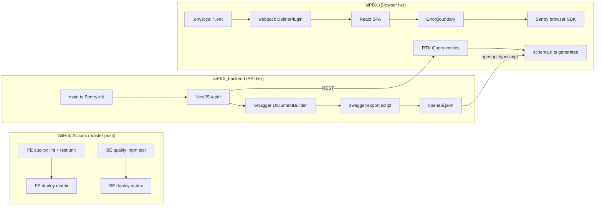

# Phase 0b: Engineering Foundation - Research

**Researched:** 2026-06-24  
**Domain:** CI quality gates, secrets hygiene, Sentry observability, OpenAPI type codegen (dual-repo)  
**Confidence:** MEDIUM

## Summary

Phase 0b establishes **safe agent execution** across `aiPBX` (frontend) and `aiPBX_backend` (backend): every `master` push runs lint + unit tests before deploy, secrets leave committed config, Sentry captures client errors, and OpenAPI codegen proves a single-entity adoption path. No product features, telephony, or billing logic changes.

**Current state (verified in repo, 2026-06-24):**

| GAP | Status | Evidence |
|-----|--------|----------|
| GAP-01 CI test gates | **Partially done** | Both `deploy.yml` files have `quality` jobs with `needs: [quality]` on deploy; FE runs `lint:ts` + `test:unit`, BE runs `npm test` |
| GAP-02 Failing BE tests | **Open** | `operator-analytics.service.spec.ts` exists; `CONCERNS.md` also reports 8 failing BE suites — conflicts with GAP-02's "5 OA failures" claim; **D-04 requires full `npm test` exit 0** |
| GAP-03 Secrets in scripts | **Mostly fixed** | `package.json` scripts are clean; `192.168.2.37` remains in `vite.config.ts` + 3 Cypress command files |
| GAP-04 FE `.env.example` | **Missing** | README references it; file absent |
| GAP-05 FE Sentry | **Mostly done** | `initSentry.ts`, webpack defines, `ErrorBoundary` already calls `Sentry.captureException` |
| GAP-06 OpenAPI codegen | **Open** | `swagger:export` script exists; committed `openapi.json` has `"paths": {}` (empty stub); `schema.d.ts` is placeholder `Record<string, unknown>`; no entity imports generated types |

**Primary recommendation:** Treat this phase as **verify-and-complete**: confirm CI gates are green end-to-end, fix all blocking test failures (FE SCSS types + BE mocks), finish env/docs hygiene, regenerate real OpenAPI artifacts, pilot codegen on **Report** `OperatorInsightsResponse` (highest Phase 1 churn — requires a small Swagger DTO addition on the insights endpoint).

<user_constraints>
## User Constraints (from CONTEXT.md)

### Locked Decisions

#### CI test gates (GAP-01)
- **D-01:** Both repos run unit tests on every `master` push before deploy job proceeds. FE: `npm run lint:ts` + `npm run test:unit`. BE: `npm test`. Verify existing `.github/workflows/deploy.yml` in both repos; add PR workflow only if zero extra scope — master push gate is sufficient for solo founder.
- **D-02:** CI must fail deploy matrix when tests fail (`needs: [quality]` already present on FE).

#### Fix failing backend tests (GAP-02)
- **D-03:** Fix all failing tests in `aiPBX_backend/src/operator-analytics/operator-analytics.service.spec.ts` (5 failures per GAPS). Root cause likely mock drift after Phase 1 insights changes — update mocks to match current `generateInsights()` / facts builder, not weaken assertions.
- **D-04:** After fix, `npm test` exits 0 locally and in CI.

#### Secrets hygiene (GAP-03, GAP-04)
- **D-05:** No secrets, API keys, or internal IPs in `package.json` scripts, webpack CLI args, or committed config. All client keys via `.env.local` / `.env` loaded by `webpack.config.ts` (already pattern).
- **D-06:** Create `aiPBX/.env.example` documenting: `API_URL`, `WS_URL`, `STATIC_URL`, `GOOGLE_CLIENT_ID`, `TELEGRAM_BOT_ID`, `STRIPE_PUBLISHABLE_KEY`, `SENTRY_DSN`, `SENTRY_ENVIRONMENT`, `YANDEX_METRIKA_ID`, `GA4_MEASUREMENT_ID`, `PORT`. No real values — placeholders only.
- **D-07:** Audit `vite.config.ts` and `cypress/support/commands/*.ts` for hardcoded `192.168.2.37` — replace with env vars documented in `.env.example` and Cypress `env` config.
- **D-08:** Extend `aiPBX_backend/.env.example` (if exists) or create with `SENTRY_DSN`, `SENTRY_ENVIRONMENT` additions; never commit `.env`.

#### Observability / Sentry (GAP-05)
- **D-09:** Frontend: keep `src/shared/config/sentry/initSentry.ts`; wire `ErrorBoundary` to `Sentry.captureException` (not console-only). Init called from `src/index.tsx` before render.
- **D-10:** Backend: keep `Sentry.init` in `main.ts`; document DSN in `.env.example`. No PII in breadcrumbs; `tracesSampleRate: 0.1` retained.
- **D-11:** Sentry is opt-in via env — empty DSN = no-op (current behavior). Production DSNs live in server secrets / GitHub Actions env, not repo.

#### OpenAPI codegen (GAP-06)
- **D-12:** Backend exports `openapi.json` (Swagger already generates at runtime; add build-time export script `npm run openapi:export` → `openapi.json` at repo root).
- **D-13:** FE `npm run generate:api-types` runs against exported spec; add npm script `generate:api-types:check` for CI drift detection (regenerate + git diff).
- **D-14:** Pilot adoption: wire **one** high-churn entity (`entities/Report` or `entities/Assistant`) RTK Query types from `src/shared/api/generated/schema.d.ts` — prove pattern without mass migration.
- **D-15:** Do not create shared npm package in this phase — codegen output stays in FE repo.

### Claude's Discretion
- Exact PR vs push-only CI trigger wording
- Which single entity to pilot for OpenAPI types (Report vs Assistant — pick highest churn)
- Cypress env file structure (`cypress.env.example.json` vs documented in README)
- Whether to add `openapi.json` to git or generate in CI only

### Deferred Ideas (OUT OF SCOPE)
- E2E tests in CI (GAP-29) — Phase 6
- SEO/prerender (GAP-15, GAP-40) — Phase 4; partial sitemap/meta work stays
- GA4/Метрика funnel goals (GAP-16) — Phase 2
- Full entity type migration to codegen — post-0b incremental
- Shared types npm package — future
</user_constraints>

<phase_requirements>
## Phase Requirements

| ID | Description | Research Support |
|----|-------------|------------------|
| GAP-01 | No test CI on push | `quality` jobs exist in both deploy workflows; verify green runs + `needs: [quality]` chain |
| GAP-02 | 5 failing OA unit tests | Fix mock drift in `operator-analytics.service.spec.ts`; reconcile with CONCERNS broader failure list for D-04 |
| GAP-03 | Secrets in `package.json` scripts | Webpack env pattern done; remove LAN IP from Vite/Cypress |
| GAP-04 | No `.env.example` on frontend | Create from `webpack.config.ts` + `buildPlugins.ts` define list |
| GAP-05 | No frontend APM (Sentry) | Init + ErrorBoundary largely done; verify opt-in + docs |
| GAP-06 | FE/BE types duplicated, no OpenAPI codegen | Regenerate real `openapi.json`, fix export, add CI drift check, pilot one entity |
</phase_requirements>

## Architectural Responsibility Map

| Capability | Primary Tier | Secondary Tier | Rationale |
|------------|-------------|----------------|-----------|
| CI lint + unit test gate | CDN / Static (GitHub Actions) | — | Runs before SSH deploy; blocks bad artifacts |
| Unit test correctness | API / Backend + Browser / Client | — | Jest in each repo validates business logic and components |
| Secrets / env documentation | Browser / Client (webpack defines) + API env | CI/CD secrets | Build-time injection (FE) and runtime env (BE); never in git |
| Frontend error capture | Browser / Client | Sentry SaaS | `initSentry` + `ErrorBoundary` in SPA entry |
| Backend error capture | API / Backend | Sentry SaaS | `Sentry.init` in `main.ts` before Nest bootstrap |
| OpenAPI schema export | API / Backend | — | NestJS Swagger `DocumentBuilder` is source of truth |
| TypeScript API types | Browser / Client | — | `openapi-typescript` generates `schema.d.ts` consumed by RTK Query |
| OpenAPI drift detection | CDN / Static (CI) | Both repos | Regenerate + `git diff` in quality jobs |

## Standard Stack

### Core

| Library | Version | Purpose | Why Standard |
|---------|---------|---------|--------------|
| Jest | FE `^29.4.2` · BE `29.7.0` | Unit test runner | Already configured; DoD gate [VERIFIED: codebase] |
| ts-jest | FE `^29.0.5` | TS transform in Jest | Matches existing config [VERIFIED: codebase] |
| `@sentry/react` | `^10.60.0` (installed) | FE error + replay | Official React SDK [CITED: docs.sentry.io/platforms/javascript/guides/react/] |
| `@sentry/nestjs` | `^10.60.0` (installed) | BE error tracing | Official Nest SDK; already in `main.ts` [VERIFIED: codebase] |
| `@nestjs/swagger` | `^11.0.3` | OpenAPI document generation | Already used in `main.ts` + export script [VERIFIED: codebase] |
| `openapi-typescript` | `^7.13.0` (installed) | FE type generation from OpenAPI | De-facto standard for types-only codegen [CITED: npmjs.com/package/openapi-typescript] |

### Supporting

| Library | Version | Purpose | When to Use |
|---------|---------|---------|-------------|
| `dotenv` | `^17.4.2` | Load `.env` / `.env.local` | Webpack config already uses it [VERIFIED: codebase] |
| `identity-obj-proxy` | `^3.0.0` | Mock SCSS in Jest | Already in `jest.config.ts` moduleNameMapper [VERIFIED: codebase] |
| Cypress `env` | `^12.12.0` | E2E API base URL | Replace hardcoded backend URL in commands [VERIFIED: codebase] |

### Alternatives Considered

| Instead of | Could Use | Tradeoff |
|------------|-----------|----------|
| `openapi-typescript` (types only) | `orval` / `openapi-fetch` | Orval adds hooks/clients — out of scope per D-15; RTK Query already owns fetching |
| Commit `openapi.json` | CI-only generation | Solo founder: **commit both `openapi.json` and `schema.d.ts`** for offline FE codegen; CI diffs catch drift [CITED: litenova.solutions OpenAPI decision doc pattern] |
| `swagger:export` (existing) | Rename to `openapi:export` | Add alias script; don't break existing docs referencing `swagger:export` |

**Installation:** No new packages required for core deliverables — all already in `package.json` files. Phase work is wiring, docs, and regeneration.

**Version note:** `openapi-typescript` 7.x requires Node 20+; CI already uses Node 22 [CITED: npmjs.com/package/openapi-typescript].

## Package Legitimacy Audit

> No new packages recommended. Existing dev/prod dependencies only. `slopcheck` unavailable in research environment — all packages tagged `[ASSUMED]` for install-gate purposes per protocol.

| Package | Registry | Source Repo | slopcheck | Disposition |
|---------|----------|-------------|-----------|-------------|
| `openapi-typescript` | npm (installed `^7.13.0`) | github.com/openapi-ts/openapi-typescript | unavailable | Approved — already in lockfile |
| `@sentry/react` | npm (installed `^10.60.0`) | github.com/getsentry/sentry-javascript | unavailable | Approved — already in lockfile |
| `@sentry/nestjs` | npm (installed `^10.60.0`) | github.com/getsentry/sentry-javascript | unavailable | Approved — already in lockfile |

**Packages removed due to slopcheck [SLOP] verdict:** none  
**Packages flagged as suspicious [SUS]:** none

## Project Constraints (from .cursor/rules/)

| Rule | Impact on Phase 0b |
|------|-------------------|
| DoD: `npm run lint:ts` + `npm run test:unit` (FE), `npm test` (BE) | Phase exit gate — both must be green |
| One GAP per active phase; no drive-by refactors | Stay within GAP-01–06; no FSD cleanup, no billing/ari touches |
| Do not touch `ari/`, `billing/`, `accounting/` without explicit phase | BE test fixes must use mocks only — no production logic edits in high-risk modules unless tests-only |
| API changes: backend DTO + frontend entity types together | Insights DTO for OpenAPI pilot is in-scope for GAP-06 |
| Update `.planning/STATE.md` after phase completion | Planner includes final task |
| Production deploy: `[deploy all]` / `[deploy:N]` tags | CI runs tests on every push; deploy still tag-gated — unchanged |
| FSD: RTK in `entities/*/api/`, types in `model/types/` | Pilot follows existing `reportApi.ts` / `assistantsApi.ts` pattern |
| Production builds: Webpack only | Vite hardcoded URL fix is hygiene only (experimental bundler) |

## Architecture Patterns

### System Architecture Diagram



### Recommended Project Structure

```
aiPBX/
├── .env.example                          # NEW (GAP-04)
├── .github/workflows/deploy.yml          # VERIFY quality job
├── config/jest/jest.config.ts            # FIX globals if needed
├── src/app/types/global.d.ts             # RESTORE *.scss module decl
├── src/shared/api/generated/schema.d.ts  # REGENERATE from real OpenAPI
├── src/shared/config/sentry/initSentry.ts
├── src/entities/Report/
│   ├── api/reportApi.ts                  # PILOT: import types from schema.d.ts
│   └── model/types/report.ts             # Re-export or alias generated types
├── cypress.config.ts                     # env: apiBaseUrl
└── cypress/support/commands/*.ts         # use Cypress.env('apiBaseUrl')

aiPBX_backend/
├── .env.example                          # VERIFY SENTRY_* present
├── .github/workflows/deploy.yml          # VERIFY quality job
├── openapi.json                          # REGENERATE (currently empty paths)
├── scripts/export-openapi.ts             # EXISTS — bootstraps AppModule
├── package.json                          # ADD openapi:export alias → swagger:export
└── src/operator-analytics/
    ├── operator-analytics.service.spec.ts # FIX mocks (GAP-02)
    └── dto/                                # ADD OperatorInsightsResponseDto for Swagger
```

### Pattern 1: CI Quality Gate Before Deploy

**What:** `quality` job runs first; `deploy` has `needs: [quality, prepare]`.  
**When to use:** Already implemented — verify, don't rewrite.  
**Example:**

```yaml
# Source: aiPBX/.github/workflows/deploy.yml (verified)
jobs:
  quality:
    steps:
      - run: npm ci
      - run: npm run lint:ts
      - run: npm run test:unit
  deploy:
    needs: [quality, prepare]
```

### Pattern 2: Webpack Env-Driven Client Secrets

**What:** `dotenv` loads `.env.local` then `.env`; values injected via `DefinePlugin` as `__VAR__` globals.  
**When to use:** All client-side keys (Stripe publishable, Sentry DSN, OAuth IDs).  
**Example:**

```typescript
// Source: aiPBX/webpack.config.ts (verified)
loadEnv({ path: path.resolve(__dirname, '.env.local') })
loadEnv({ path: path.resolve(__dirname, '.env') })
const sentryDsn = process.env.SENTRY_DSN || ''
// → buildPlugins DefinePlugin __SENTRY_DSN__
```

### Pattern 3: Sentry Opt-In (Empty DSN = No-Op)

**What:** Skip `Sentry.init` when DSN is empty.  
**When to use:** Local dev without Sentry project.  
**Example:**

```typescript
// Source: aiPBX/src/shared/config/sentry/initSentry.ts (verified)
const dsn = typeof __SENTRY_DSN__ !== 'undefined' ? __SENTRY_DSN__ : ''
if (!dsn) return
Sentry.init({ dsn, tracesSampleRate: 0.1, /* replay on error */ })
```

**FE status:** `ErrorBoundary.componentDidCatch` already calls `Sentry.captureException` — D-09 is **verify**, not reimplement [VERIFIED: codebase].

### Pattern 4: OpenAPI Export via Nest Bootstrap

**What:** `scripts/export-openapi.ts` creates Nest app, builds Swagger document, writes `openapi.json`.  
**When to use:** Before FE `generate:api-types`.  
**Caveat:** `NestFactory.create(AppModule)` initializes Sequelize — export requires valid `DB_*` env (`.development.env`) or CI must provide test DB / override [VERIFIED: export-openapi.ts comment + app.module.ts SequelizeModule].

### Pattern 5: CI Drift Check for Generated Types

**What:** Regenerate, then fail if git dirty.  
**When to use:** `generate:api-types:check` in FE quality job.  
**Example:**

```bash
# Pattern from community + openapi-typescript docs [CITED: julianoalves.me, npmjs.com/package/openapi-typescript]
npm run generate:api-types
git diff --exit-code src/shared/api/generated/schema.d.ts
```

**Important:** Prettier-format generated output if team uses Prettier — avoids spurious whole-file diffs [CITED: github.com/markmhendrickson/neotoma commit 6baab02].

### Pattern 6: OpenAPI Type Pilot in RTK Query

**What:** Import `components['schemas']['X']` from generated schema; use as generic on `build.query` / `build.mutation`.  
**When to use:** Single entity pilot (D-14).  
**Example:**

```typescript
// Source: openapi-typescript npm README pattern [CITED: npmjs.com/package/openapi-typescript]
import type { components } from '@/shared/api/generated/schema'

type OperatorInsightsResponse = components['schemas']['OperatorInsightsResponseDto']

getOperatorInsights: build.query<OperatorInsightsResponse, { /* args */ }>({ ... })
```

**Prerequisite:** Backend controller must expose schema via `@ApiResponse({ type: OperatorInsightsResponseDto })` — current `GET /operator-analytics/insights` only has description, no `type` [VERIFIED: operator-analytics.controller.ts].

### Anti-Patterns to Avoid

- **Hand-editing `schema.d.ts`:** Always regenerate; CI drift check exists to enforce this.
- **Weakening test assertions to green CI:** D-03 explicitly forbids for OA tests.
- **Putting DSN/keys in `package.json` scripts:** Use `.env` only (D-05).
- **Assuming FE CI can read `../aiPBX_backend/openapi.json`:** Default checkout is single-repo — plan dual-checkout or vendored spec copy (see Open Questions).

## Don't Hand-Roll

| Problem | Don't Build | Use Instead | Why |
|---------|-------------|-------------|-----|
| OpenAPI → TS types | Manual interface duplication | `openapi-typescript` | Hundreds of paths; silent drift already happening |
| CI test orchestration | Custom shell deploy hooks | GitHub Actions `needs:` DAG | Already present; standard failure semantics |
| Client error reporting | `console.error` only in ErrorBoundary | `@sentry/react` + `captureException` | Already integrated |
| Env documentation | README-only prose | `.env.example` with placeholders | Onboarding + agent safety |
| SCSS imports in Jest | Ignore TS errors | `declare module '*.scss'` in `global.d.ts` | TS compile fails before Jest runs |

**Key insight:** The phase is mostly **wiring and verification** — the manual 2026-06-24 session already added CI steps, Sentry stubs, and webpack env. Reimplementing would violate CONTEXT "do not revert."

## Common Pitfalls

### Pitfall 1: Empty Committed `openapi.json`

**What goes wrong:** `generate:api-types` produces useless `Record<string, unknown>` stubs.  
**Why it happens:** Committed `openapi.json` has `"paths": {}` — export never run successfully or stub committed [VERIFIED: openapi.json line 8].  
**How to avoid:** Run `npm run swagger:export` with valid DB env; commit populated file; add BE CI diff check.  
**Warning signs:** `schema.d.ts` stays at 9-line placeholder.

### Pitfall 2: Frontend Jest Fails at TypeScript Compile (SCSS Modules)

**What goes wrong:** 14/21 FE test suites fail with `TS2307: Cannot find module '*.module.scss'`.  
**Why it happens:** `src/app/types/global.d.ts` lacks `declare module '*.scss'` (exists in `global.d.ts.bak` only) [VERIFIED: CONCERNS.md + file compare].  
**How to avoid:** Restore SCSS module declaration block from `.bak` into active `global.d.ts`.  
**Warning signs:** `npm run test:unit` fails before any assertion runs.

### Pitfall 3: D-03 vs D-04 Scope Tension on Backend Tests

**What goes wrong:** Fixing only OA spec still leaves `npm test` red.  
**Why it happens:** GAP-02 cites 5 OA failures; CONCERNS.md lists 8 suites / 13 tests across auth, payments, accounting, etc.  
**How to avoid:** Wave 0: run `npm test`, enumerate all failures; plan fixes for **all** to satisfy D-04 (mock/DI drift pattern same as OA).  
**Warning signs:** OA spec green but CI still fails.

### Pitfall 4: OpenAPI Export Requires Database

**What goes wrong:** `swagger:export` crashes in CI without `DB_*` vars.  
**Why it happens:** `export-openapi.ts` bootstraps full `AppModule` with `SequelizeModule.forRootAsync` [VERIFIED: app.module.ts].  
**How to avoid:** Provide `.development.env` in CI secrets, use docker service postgres in quality job, or refactor export to a minimal Swagger-only module (larger scope — defer unless export keeps failing).  
**Warning signs:** `Failed to export OpenAPI schema` in CI logs.

### Pitfall 5: Cross-Repo Path in FE Codegen Script

**What goes wrong:** `generate:api-types` path `../aiPBX_backend/openapi.json` missing in FE-only CI checkout.  
**Why it happens:** Sibling layout exists locally but not in GitHub Actions by default [VERIFIED: package.json script].  
**How to avoid:** Dual `actions/checkout` (backend into `../aiPBX_backend`) OR vendor `openapi.json` into FE `src/shared/api/openapi.json`.  
**Warning signs:** `ENOENT` on openapi path in CI.

### Pitfall 6: Insights Endpoint Missing Swagger Schema

**What goes wrong:** Pilot on `OperatorInsightsResponse` yields no `components.schemas` entry.  
**Why it happens:** Controller uses `@ApiResponse({ description })` without `type` [VERIFIED: operator-analytics.controller.ts:590].  
**How to avoid:** Add `OperatorInsightsResponseDto` class with `@ApiProperty` fields matching `insights-schema.ts` interfaces.  
**Warning signs:** `components['schemas']['OperatorInsightsResponseDto']` is `undefined` in IDE.

### Pitfall 7: Sentry PII in Replay

**What goes wrong:** Session replay captures sensitive call/billing UI text.  
**Why it happens:** Replay enabled on error with `maskAllText: true` already set — verify no custom breadcrumbs log tokens [VERIFIED: initSentry.ts `maskAllText: true`].  
**How to avoid:** Keep `maskAllText: true`; don't add `beforeSend` that attaches Redux state with JWT.  
**Warning signs:** User emails or API tokens in Sentry event extras.

## Code Examples

### Cypress API Base URL from Env

```typescript
// Source: Cypress docs pattern [ASSUMED — standard Cypress env API]
// cypress.config.ts
export default defineConfig({
  e2e: {
    baseUrl: 'http://localhost:3000',
    env: {
      apiBaseUrl: process.env.CYPRESS_API_BASE_URL || 'http://localhost:7000',
    },
  },
})

// cypress/support/commands/common.ts
const apiBase = Cypress.env('apiBaseUrl')
cy.request({ method: 'POST', url: `${apiBase}/api/auth/login`, body: { ... } })
```

### FE `.env.example` Skeleton

```bash
# Source: webpack.config.ts env keys (verified)
API_URL=/api
WS_URL=
STATIC_URL=/static
PORT=3000
GOOGLE_CLIENT_ID=
TELEGRAM_BOT_ID=
STRIPE_PUBLISHABLE_KEY=
SENTRY_DSN=
SENTRY_ENVIRONMENT=development
YANDEX_METRIKA_ID=
GA4_MEASUREMENT_ID=

# Cypress (optional, for E2E against remote API)
CYPRESS_API_BASE_URL=http://localhost:7000
```

### `generate:api-types:check` Script

```json
{
  "scripts": {
    "generate:api-types": "openapi-typescript ../aiPBX_backend/openapi.json -o src/shared/api/generated/schema.d.ts",
    "generate:api-types:check": "npm run generate:api-types && git diff --exit-code -- src/shared/api/generated/schema.d.ts"
  }
}
```

### Backend `openapi:export` Alias

```json
{
  "scripts": {
    "swagger:export": "ts-node -r tsconfig-paths/register scripts/export-openapi.ts",
    "openapi:export": "npm run swagger:export"
  }
}
```

### Restore SCSS Module Types for Jest

```typescript
// Source: src/app/types/global.d.ts.bak (verified)
declare module '*.scss' {
  type IClassNames = Record<string, string>
  const classNames: IClassNames
  export = classNames
}
```

## State of the Art

| Old Approach | Current Approach | When Changed | Impact |
|--------------|------------------|--------------|--------|
| CI lint-only on deploy | CI lint + unit tests | 2026-06-24 manual | GAP-01 partially closed |
| Console-only ErrorBoundary | `Sentry.captureException` | 2026-06-24 manual | GAP-05 mostly closed |
| Secrets in npm scripts | Webpack `.env` injection | 2026-06-24 manual | GAP-03 mostly closed |
| Hand-written entity types only | `openapi-typescript` scaffold | Pre-2026, unused | GAP-06 still open — adoption needed |
| `swagger:export` script name | CONTEXT prefers `openapi:export` | — | Add alias, keep both |

**Deprecated/outdated:**
- Committed empty `openapi.json` — must regenerate before codegen has value.
- `global.d.ts` without SCSS modules — breaks Jest TS pipeline.

## Assumptions Log

| # | Claim | Section | Risk if Wrong |
|---|-------|---------|---------------|
| A1 | Cypress `Cypress.env()` + `process.env` in `cypress.config.ts` is sufficient for D-07 | Code Examples | May need `cypress.env.json` gitignored pattern instead |
| A2 | Fixing OA spec + SCSS types is enough for CI green | Pitfall 3 | D-04 may require fixing all 8 BE suites per CONCERNS |
| A3 | `swagger:export` succeeds with standard `.development.env` DB vars | Pitfall 4 | May need CI postgres service or export refactor |
| A4 | Dual repo checkout in FE Actions is acceptable for solo founder | Open Questions | May prefer vendored `openapi.json` in FE |
| A5 | Report entity is highest-churn pilot vs Assistants | Summary | Assistant has better existing Swagger `type: Assistant` coverage |

## Open Questions (RESOLVED)

1. **Full backend test failure set** — RESOLVED: 00b-01 Task 3 runs full `npm test` enumeration; Task 4 fixes all failing suites (not OA-only) per D-04.
2. **OpenAPI spec location for FE CI** — RESOLVED: Commit `openapi.json` in BE repo; FE uses sibling path locally; per-repo CI checks (`openapi:check` BE, `generate:api-types:check` FE).
3. **Pilot entity: Report vs Assistants** — RESOLVED: Report `OperatorInsightsResponse` with new `OperatorInsightsResponseDto` (00b-03 Task 2).
4. **`openapi:export` vs `swagger:export` naming** — RESOLVED: Add `openapi:export` npm alias pointing to `swagger:export` per D-12.

## Environment Availability

| Dependency | Required By | Available | Version | Fallback |
|------------|------------|-----------|---------|----------|
| Node.js | CI + local dev | ✓ (CI config) | 22 in deploy.yml | — |
| npm | CI scripts | ✓ | — | — |
| PostgreSQL / MySQL | `swagger:export` | ✗ in CI by default | — | CI service container or local `.development.env` |
| Sibling repo layout | `generate:api-types` | ✓ locally | — | Dual checkout or vendored spec in CI |
| Sentry project + DSN | Production observability | optional | — | Empty DSN no-op (D-11) |
| slopcheck | Package audit | ✗ | — | All packages `[ASSUMED]` |

**Missing dependencies with no fallback:**
- Database for OpenAPI export in CI (blocks automated `openapi.json` drift check until addressed)

**Missing dependencies with fallback:**
- Sentry DSN — app runs without it
- Cypress API URL — defaults to `localhost:7000` in examples

## Validation Architecture

### Test Framework

| Property | Value |
|----------|-------|
| Framework | Jest FE `^29.4.2` · BE `29.7.0` |
| Config file | FE: `config/jest/jest.config.ts` · BE: `package.json` jest key |
| Quick run command | FE: `npm run test:unit` · BE: `npm test` |
| Full suite command | Same (no separate integration gate in this phase) |

### Phase Requirements → Test Map

| Req ID | Behavior | Test Type | Automated Command | File Exists? |
|--------|----------|-----------|-------------------|-------------|
| GAP-01 | CI blocks deploy on test failure | CI workflow | Push to master → quality job | ✅ deploy.yml both repos |
| GAP-01 | FE unit tests pass | unit | `npm run lint:ts && npm run test:unit` | ✅ |
| GAP-01 | BE unit tests pass | unit | `npm test` | ✅ |
| GAP-02 | OA service tests pass | unit | `npm test -- operator-analytics.service.spec.ts` | ✅ |
| GAP-02 | All BE tests pass (D-04) | unit | `npm test` | ✅ (may need fixes beyond OA) |
| GAP-03 | No secrets in committed config | manual grep | `rg "192\.168|pk_live|sk_live" --glob '!*.md'` | ✅ |
| GAP-04 | `.env.example` documents vars | manual | File exists + matches webpack keys | ❌ Wave 0 |
| GAP-05 | Sentry captures boundary errors | unit/manual | Mock `Sentry.captureException` in ErrorBoundary test optional | ❌ optional |
| GAP-06 | Generated types match OpenAPI | CI script | `npm run generate:api-types:check` | ❌ Wave 0 |
| GAP-06 | Pilot entity compiles with generated types | unit/tsc | `npm run lint:ts` | ❌ after pilot |

### Sampling Rate

- **Per task commit:** `npm run lint:ts` (FE) or `npm test -- <affected.spec>` (BE)
- **Per wave merge:** Full `npm run test:unit` / `npm test`
- **Phase gate:** Both repos green before `/gsd-verify-work`

### Wave 0 Gaps

- [ ] Run `npm test` (BE) — enumerate all failing suites for D-04
- [ ] Run `npm run test:unit` (FE) — confirm SCSS module fix unblocks compile
- [ ] Regenerate `aiPBX_backend/openapi.json` via `npm run swagger:export`
- [ ] Add `generate:api-types:check` to FE `package.json`
- [ ] Create `aiPBX/.env.example`
- [ ] Add `OperatorInsightsResponseDto` (or equivalent) for Swagger on insights endpoint
- [ ] Decide FE CI strategy for cross-repo OpenAPI path

## Security Domain

### Applicable ASVS Categories

| ASVS Category | Applies | Standard Control |
|---------------|---------|------------------|
| V2 Authentication | no | — (no auth changes) |
| V3 Session Management | no | — |
| V4 Access Control | no | — |
| V5 Input Validation | no | — (no new endpoints) |
| V6 Cryptography | partial | Secrets out of repo; Sentry DSN in env only |
| V14 Configuration | yes | `.env.example` placeholders; no real keys in git |

### Known Threat Patterns for This Stack

| Pattern | STRIDE | Standard Mitigation |
|---------|--------|---------------------|
| Secrets in git history | Information disclosure | `.env.example` only; grep audit for LAN IPs and live keys |
| Client DSN exposure | Information disclosure | Sentry DSN is public by design — use project rate limits; no backend secrets in FE |
| Session replay PII | Information disclosure | `maskAllText: true`, `blockAllMedia: true` in replay integration [VERIFIED: initSentry.ts] |
| Stale API types → UI trust of wrong shapes | Tampering | CI drift check on `schema.d.ts` |

## Sources

### Primary (HIGH confidence)
- Codebase verification — `deploy.yml`, `webpack.config.ts`, `initSentry.ts`, `ErrorBoundary.tsx`, `export-openapi.ts`, `openapi.json`, `package.json` (both repos)
- [Sentry React SDK docs](https://docs.sentry.io/platforms/javascript/guides/react/) — init order, ErrorBoundary, `tracesSampleRate`

### Secondary (MEDIUM confidence)
- [openapi-typescript npm](https://www.npmjs.com/package/openapi-typescript) — CLI usage, `components`/`paths` import pattern
- [OpenAPI CI drift pattern](https://julianoalves.me/blog/openapi-typesafe-client) — regenerate + `git diff --exit-code`
- `.planning/codebase/TESTING.md`, `CONCERNS.md`, `RECONCILIATION.md` — test conventions and verified debt

### Tertiary (LOW confidence)
- CONCERNS "8 suites / 13 tests" BE failure count — needs `npm test` re-run to confirm current state
- Exact OA spec failure messages — not captured in research session

## Metadata

**Confidence breakdown:**
- Standard stack: **HIGH** — all tools already installed and partially wired
- Architecture: **MEDIUM** — cross-repo CI for OpenAPI unresolved
- Pitfalls: **MEDIUM** — test failure scope and export DB dependency need runtime confirmation

**Research date:** 2026-06-24  
**Valid until:** 2026-07-24 (stable tooling); re-run after major Nest/OpenAPI upgrade

## RESEARCH COMPLETE

**Phase:** 0b - Engineering Foundation  
**Confidence:** MEDIUM

### Key Findings
- CI quality gates are **already wired** in both repos (`quality` → `deploy`); phase work is making them **green** and documented.
- FE `test:unit` is likely blocked by **missing `*.scss` module declarations** in `global.d.ts`, not test logic.
- Committed `openapi.json` is an **empty stub** (`paths: {}`); codegen and pilot are blocked until `swagger:export` succeeds.
- Sentry FE path is **largely complete** (init + ErrorBoundary); BE `.env.example` already documents `SENTRY_*`.
- **Report** entity recommended for OpenAPI pilot (Phase 1 insights churn) but requires adding a Swagger DTO on `GET /insights`.

### File Created
`.planning/phases/00b-engineering-foundation/00b-RESEARCH.md`

### Confidence Assessment
| Area | Level | Reason |
|------|-------|--------|
| Standard Stack | HIGH | Existing Jest, Sentry, openapi-typescript in both repos |
| Architecture | MEDIUM | Cross-repo OpenAPI CI path undecided |
| Pitfalls | MEDIUM | BE failure count conflict; export needs DB |

### Open Questions
- Full BE test failure enumeration (D-03 vs D-04)
- FE CI strategy for sibling `openapi.json` access
- Report vs Assistants pilot if insights DTO work is too heavy

### Ready for Planning
Research complete. Planner can now create PLAN.md files.
