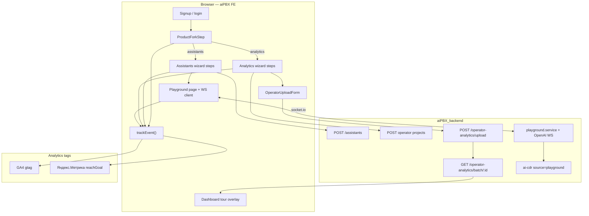

# Phase 02: Onboarding Conversion — Research

**Researched:** 2026-06-24  
**Domain:** Dual-product onboarding funnel (Voice Assistants + Speech Analytics), conversion analytics, docs screenshots  
**Confidence:** HIGH (codebase-verified); MEDIUM (screenshot automation path; tour UX choice)

## Summary

Phase 2 transforms the existing assistants-only `OnboardingWizard` into a **dual-product conversion funnel** where new RU B2B users choose Voice Assistants or Speech Analytics and reach first success within ≤15 minutes. The codebase already provides the heavy lifting: assistant creation (`BusinessTypeStep`), OA project wizard (`ProjectWizard` + `projectWizardSlice`), file upload (`OperatorUploadForm` + async batch API), Playground WebSocket sessions (`usePlaygroundSession`), and analytics plumbing (`initAnalytics` / `trackEvent`). **No backend API changes are required** for core onboarding — only frontend orchestration, event wiring, and asset capture.

The highest-risk implementation choices are (1) **branch-aware onboarding state** without entangling two wizards in one flat step index, (2) **reliable `playground_call_success` detection** without billing polling, and (3) **embedding a simplified OA flow** inside the onboarding overlay without pulling in webhook/budget complexity. Screenshot work is decoupled: Cypress and Storybook/Loki already exist; Playwright is not in the repo.

**Primary recommendation:** Extend `onboardingSlice` with `productPath` + per-branch step maps; embed simplified OA steps reusing `projectWizard` reducer and step components inside the onboarding overlay; detect Playground success via existing `eventProcessor` metrics on session end; detect OA success via `useBatchProgress` batch completion; wire all transitions through a thin `trackOnboardingEvent()` helper; capture docs screenshots with a Cypress auth fixture script (avoid new Playwright dependency unless full-page fidelity requires it).

## Architectural Responsibility Map

| Capability | Primary Tier | Secondary Tier | Rationale |
|------------|-------------|----------------|-----------|
| Product fork UI | Browser / Client | — | Onboarding overlay in `App.tsx`; no server session for fork |
| Assistants wizard steps | Browser / Client | API / Backend | UI drives flow; assistant CRUD via existing REST |
| Playground call session | API / Backend (WS) | Browser / Client | `playground.service.ts` owns session/CDR; FE detects success from WS events |
| OA project creation | Browser / Client | API / Backend | `useCreateOperatorProject` RTK mutation |
| File upload + analysis | API / Backend | Browser / Client | Upload POST returns `batchId`; FE polls batch status |
| Dashboard tour | Browser / Client | — | Highlights on `OperatorDashboard` at `/dashboard/call-records` |
| Funnel events (GA4/Метрика) | Browser / Client | CDN / Static (tag scripts) | `trackEvent()` fires client-side goals |
| Docs screenshots | CDN / Static | Browser (capture tool) | Assets in `public/docs/screenshots/` |
| Re-entry button | Browser / Client | — | Avatar dropdown / shell chrome |

<user_constraints>
## User Constraints (from CONTEXT.md)

### Locked Decisions
- **D-01:** On first login after signup, user **must** choose product path: Voice Assistants or Speech Analytics.
- **D-02:** After onboarding completed, same fork is reachable via **one entry point** (single button — not necessarily two separate menu items). User picks assistants or analytics again inside that flow.
- **D-03:** Both products are first-class; onboarding is not assistants-only anymore.
- **D-04:** Keep current wizard structure as base (business template → assistant creation → publish overview → completion), but **primary success = Playground call** before treating onboarding as done.
- **D-05:** After successful Playground call, present **next steps**: connect SIP trunk for own PBX **or** embed website widget (non-blocking; user can defer).
- **D-06:** Replace mandatory Telegram step with **«Простой пример»** — simple, clear walkthrough of configuring and using the assistant on a concrete scenario. **Telegram remains optional** — mention that integration is available, but not required (blocked in RU).
- **D-07:** Wizard must **drive user to Playground** (deep-link / prominent CTA), not offer four equal exits without guidance. Other destinations (dashboard, docs, assistants list) remain secondary after success or via skip.
- **D-08:** New onboarding branch modeled on `ProjectWizard` — collaborative project creation: name, industry/tasks, **custom metrics or templates** from existing catalog.
- **D-09:** After project created, offer **upload arbitrary call recording** (primary first-success path) **or** introduce **API** for automatic call export from client PBX (educational step + docs; full connector setup not required in this phase).
- **D-10:** Show `OperatorDashboard` capabilities: AI insights, operator reports, key widgets — guided tour or highlight overlay after first analysis (or empty-state preview before data).
- **D-11:** Analytics first success = **first file uploaded and analysis completed** (symmetric to Playground call for assistants).
- **D-12:** Track **both paths separately** via existing `trackEvent()` in `initAnalytics.ts`.
- **D-13:** Minimum event set:
  - `onboarding_started`, `onboarding_product_assistants`, `onboarding_product_analytics`
  - `onboarding_step_{n}` (per wizard step, path-prefixed if needed)
  - `assistant_created`, `playground_call_success`
  - `oa_project_created`, `oa_file_uploaded`, `oa_first_analysis_complete`
  - `onboarding_completed`, `onboarding_skipped` (if skip allowed)
- **D-14:** Funnel goals in both GA4 and Яндекс.Метрика for **all domains** where analytics IDs are configured (not ru-only).
- **D-15:** Replace placeholders in `public/docs/screenshots/` with **real page captures or high-fidelity mocks** of actual UI (redesign-v3). Agent may use Playwright/screenshot from dev build or composed mock from real components — must look like production, not generic placeholders.
- **D-16:** Priority screenshots (from `screenshots/README.md`): dashboard, assistant create, SIP publish, tool create, playground, reports history. Add OA-relevant captures if docs reference analytics (project wizard, upload, operator dashboard).
- **D-17:** New onboarding UI only in `shared/ui/redesign-v3/`.
- **D-18:** Reuse `DynamicModuleLoader` + Redux slice pattern from existing `Onboarding` feature; analytics branch may reuse `projectWizard` slice/actions where possible.
- **D-19:** Signup trigger: keep `onboarding_is_signup` localStorage flag; extend state to include `productPath: 'assistants' | 'analytics'`.

### Claude's Discretion
- Exact step count and naming for each branch after fork
- Whether Playground call success is detected via WebSocket event, billing record, or UI callback
- Dashboard tour implementation: spotlight overlay vs dedicated onboarding sub-route
- Screenshot capture method (Playwright vs manual staging) per environment constraints
- Skip button visibility and whether skip blocks funnel "completed" goal

### Deferred Ideas (OUT OF SCOPE)
- Full OA API connector onboarding (SIP/CDR webhook provisioning) — deep setup in docs + Phase 3 integration hardening
- `aggregatedCustomMetrics` backend widget — Phase 3 (GAP-12)
- Insights drill-down to CDR — Phase 3 (REQ-11)
- Freemium / trial tier messaging in onboarding — GAP-46, future GTM phase
- Second onboarding path auto-suggested (“You created an assistant — try analytics?”) — optional enhancement post-MVP
</user_constraints>

<phase_requirements>
## Phase Requirements

| ID | Description | Research Support |
|----|-------------|------------------|
| GAP-10 | Onboarding: «first call in 15 min» flow untested | Dual fork + Playground/OA success gates; slice milestones; manual voice checklist in plan |
| GAP-14 | Docs screenshots are placeholders | Cypress capture script + Storybook fallback; file inventory in `public/docs/screenshots/README.md` |
| GAP-16 | No conversion funnel analytics | `trackEvent()` wiring map; event names D-13; GA4/Метрика goal doc for ops |
</phase_requirements>

## Project Constraints (from .cursor/rules/)

- Planning root: `.planning/`; backend sibling at `c:/Users/Professional/WebstormProjects/aiPBX_backend`
- DoD: `npm run lint:ts`, `npm run test:unit`, i18n `ru` + `en` minimum, update `STATE.md` after phase
- Scope: one GAP per active phase; no `ari/`, `billing/`, `accounting/` changes
- **New UI only in** `src/shared/ui/redesign-v3/` (D-17 aligns with `frontend-fsd.mdc`)
- FSD layers: features/Onboarding, entities/Report, entities/Assistants
- Production build: Webpack (`npm run build:prod`); analytics via `YANDEX_METRIKA_ID`, `GA4_MEASUREMENT_ID` in `config/build/buildPlugins.ts`
- Do not commit secrets; E2E not in CI (Phase 6)

## Standard Stack

### Core (existing — no new runtime deps required)

| Library | Version (repo) | Purpose | Why Standard |
|---------|----------------|---------|--------------|
| `@reduxjs/toolkit` | in `package.json` | `onboardingSlice`, `projectWizardSlice` | Established pattern |
| `react-router-dom` | v5 patterns in repo | Deep-link Playground, navigate post-success | Already used |
| `socket.io-client` | in `usePlaygroundSession` | Playground realtime | Backend `playground.service.ts` |
| RTK Query (`reportApi`) | `uploadOperatorFiles`, batch status | OA upload funnel | Async batch-of-1 always [CITED: backend controller] |
| `initAnalytics` / `trackEvent` | `src/shared/config/analytics/initAnalytics.ts` | GA4 + Метрика goals | GAP-16 infra from Phase 0b |

### Supporting

| Library | Version | Purpose | When to Use |
|---------|---------|---------|-------------|
| Cypress | `^12.12.0` [VERIFIED: package.json] | Docs screenshot automation | Authenticated page captures |
| Storybook + Loki | `^7.0.11` / project config | Component visual regression | Isolated widget captures only |
| `react-toastify` | existing | Upload/batch feedback | Already in `OperatorUploadForm` |

### Alternatives Considered

| Instead of | Could Use | Tradeoff |
|------------|-----------|----------|
| Cypress screenshots | Playwright script | Playwright not in repo; adds devDep + auth boilerplate |
| Custom spotlight tour | `react-joyride` / `driver.js` | No tour lib in codebase; new package + a11y review |
| Full `ProjectWizard` modal | Simplified embedded steps | Full wizard includes webhooks/review — overkill for first run |
| CDR poll for Playground success | WS `eventProcessor` metrics | CDR exists on hangup but adds latency and API coupling |

**Installation:** None required for core phase. Optional screenshot script uses existing Cypress.

## Package Legitimacy Audit

> No new packages required for core onboarding implementation. Optional tour/screenshot packages evaluated for discretion areas.

| Package | Registry | slopcheck | Disposition |
|---------|----------|-----------|-------------|
| (none required) | — | — | Use existing stack |

**Packages removed due to slopcheck [SLOP] verdict:** none  
**Packages flagged as suspicious [SUS]:** none  

*slopcheck unavailable at research time — if planner adds `react-joyride` or `@playwright/test`, gate behind `checkpoint:human-verify` and run Package Legitimacy Gate before install.*

## Architecture Patterns

### System Architecture Diagram



### Recommended Project Structure

```
src/features/Onboarding/
├── model/
│   ├── types/onboarding.ts          # + productPath, milestones, branch steps
│   ├── slices/onboardingSlice.ts    # branch-aware navigation
│   ├── selectors/onboardingSelectors.ts
│   └── lib/
│       ├── onboardingAnalytics.ts   # trackOnboardingEvent wrapper
│       ├── onboardingSteps.ts       # ASSISTANTS_STEPS / ANALYTICS_STEPS constants
│       └── usePlaygroundSuccess.ts  # optional hook for PG detection
├── ui/
│   ├── OnboardingWizard/            # conditional stepsMap per productPath
│   └── steps/
│       ├── ProductForkStep.tsx      # NEW — D-01
│       ├── SimpleExampleStep.tsx    # NEW — replaces TelegramStep (D-06)
│       ├── PlaygroundGateStep.tsx   # NEW — CTA before complete (D-07)
│       ├── PostSuccessStep.tsx      # NEW — trunk/widget cards (D-05)
│       ├── analytics/
│       │   ├── AnalyticsProjectStep.tsx  # embed WizardStep0 + review lite
│       │   ├── AnalyticsUploadStep.tsx   # OperatorUploadForm wrapper
│       │   └── AnalyticsTourStep.tsx     # tour or navigate + overlay
│       └── ...existing assistants steps
```

### Pattern 1: Branch-aware onboarding slice

**What:** Separate step indices per `productPath`; shared fork step.

**When to use:** Any time `nextStep`/`prevStep` runs — guard max step by branch.

**Example:**

```typescript
// src/features/Onboarding/model/types/onboarding.ts
export type OnboardingProductPath = 'assistants' | 'analytics'

export interface OnboardingMilestones {
  assistantCreated: boolean
  playgroundCallSuccess: boolean
  oaProjectCreated: boolean
  oaFileUploaded: boolean
  oaFirstAnalysisComplete: boolean
}

export interface OnboardingState {
  isActive: boolean
  productPath: OnboardingProductPath | null
  currentStep: number
  milestones: OnboardingMilestones
  // ...existing fields
}

export const ONBOARDING_PRODUCT_KEY = 'onboarding_product_path'
```

```typescript
// Slice: setProductPath + branch-specific TOTAL_STEPS from onboardingSteps.ts
setProductPath: (state, action: PayloadAction<OnboardingProductPath>) => {
  state.productPath = action.payload
  state.currentStep = 1 // after fork
  localStorage.setItem(ONBOARDING_PRODUCT_KEY, action.payload)
}
```

### Pattern 2: DynamicModuleLoader with dual reducers (analytics branch)

**What:** Mount `onboarding` + `projectWizard` reducers when analytics branch active.

**When to use:** Analytics project step inside overlay (mirrors `OperatorProjectManager`).

**Example:** [CITED: `OperatorProjectManager.tsx` lines 28-30, 190]

```typescript
const reducers: ReducersList = {
  onboarding: onboardingReducer,
  projectWizard: projectWizardReducer,
}
```

### Pattern 3: Playground success detection (recommended — UI / WebSocket)

**What:** On session end, evaluate `eventProcessor` state: `turnCount >= 1`, user transcript item with non-empty text, assistant `response.done` observed.

**When to use:** User disconnects or stops session while `localStorage.onboarding_playground_pending === 'true'`.

**Signals available today** [VERIFIED: codebase grep]:
- `response.done` increments `turnCount` (`eventProcessor.ts:195-211`)
- User speech: `conversation.item.input_audio_transcription.completed`
- Backend CDR on hangup (`playground.service.ts:285-294`) — **not recommended for v1** (no FE hook, async)

**Example:**

```typescript
function isPlaygroundCallSuccess(metrics: SessionMetrics, transcript: TranscriptItem[]): boolean {
  const hasUserSpeech = transcript.some(t => t.role === 'user' && t.text.trim().length > 0)
  const hasAssistantReply = transcript.some(t => t.role === 'assistant' && t.text.trim().length > 0)
  return metrics.turnCount >= 1 && hasUserSpeech && hasAssistantReply
}
```

Wire in `PlaygroundSessionV2.handleStopSession` or a dedicated `useOnboardingPlaygroundTracker` reading `createdAssistantId` from onboarding selectors.

### Pattern 4: OA analysis completion via batch polling

**What:** Reuse `useBatchProgress.startPolling(batchId)` from `CallsPage` pattern.

**When to use:** After `uploadOperatorFiles` returns `batchId` (always async, including single file) [CITED: `operator-analytics.controller.ts:131-132`].

**Example:**

```typescript
// On batch finished: completed >= 1 → trackEvent('oa_first_analysis_complete')
// On upload submit success → trackEvent('oa_file_uploaded')
```

Extract shared `useOnboardingBatchProgress` or pass `onBatchFinished` callback into onboarding upload step.

### Pattern 5: trackEvent integration

**What:** Thin wrapper adding `product_path`, `step_id`, `step_index` params.

```typescript
// src/features/Onboarding/model/lib/onboardingAnalytics.ts
import { trackEvent } from '@/shared/config/analytics/initAnalytics'

export function trackOnboardingEvent(
  name: string,
  ctx: { productPath?: string; step?: string | number; [k: string]: string | number | undefined }
) {
  const params: Record<string, string | number> = {}
  Object.entries(ctx).forEach(([k, v]) => { if (v !== undefined) params[k] = v })
  trackEvent(name, params)
}
```

**Integration points:**

| Event | Trigger location |
|-------|------------------|
| `onboarding_started` | `startOnboarding` reducer or `OnboardingWizard` signup effect |
| `onboarding_product_*` | `ProductForkStep` on select |
| `onboarding_step_{n}` | `nextStep` / `goToStep` middleware or per-step `useEffect` |
| `assistant_created` | `BusinessTypeStep` after `setCreatedAssistantId` |
| `playground_call_success` | Playground stop + success heuristic |
| `oa_project_created` | `createProject().unwrap()` in analytics step |
| `oa_file_uploaded` | `OperatorUploadForm` submit success (onboarding wrapper) |
| `oa_first_analysis_complete` | `useBatchProgress` batch finished |
| `onboarding_completed` | `completeOnboarding` when milestones met |
| `onboarding_skipped` | `skipOnboarding` (WelcomeStep / header skip) |

`trackEvent` already maps Метрика `reachGoal` + GA4 `gtag('event')` [VERIFIED: `initAnalytics.ts:46-56`]. D-14 goal configuration is **ops documentation** (GA4 Admin + Metrika goals) — not code.

### Anti-Patterns to Avoid

- **Flat step 0-4 for both products:** Breaks when analytics branch needs different count — use branch step maps.
- **Completing onboarding before Playground success:** Current `CompletionStep` calls `completeOnboarding()` on Playground navigate — violates D-04/D-07.
- **Mandatory Telegram:** Blocks RU users — replace with `SimpleExampleStep` per D-06.
- **Admin-only re-entry:** `AvatarDropdown` gates onboarding to `isAdmin` only — violates D-02 for normal users.
- **New tour npm package without UX review:** No existing tour dependency; prefer custom `redesign-v3` spotlight overlay.
- **Polling CDR for Playground v1:** Adds complexity; WS metrics sufficient for funnel.

## Don't Hand-Roll

| Problem | Don't Build | Use Instead | Why |
|---------|-------------|-------------|-----|
| OA upload + progress | Custom polling | `useBatchProgress` + `getBatchStatus` RTK | Rate-limited round-robin already implemented |
| Project creation form | Duplicate metric builder | `projectWizardActions` + step components | Templates, metrics, API payload aligned |
| Analytics tags | Custom pixel code | `trackEvent()` | GA4 + Метрика dual dispatch exists |
| Playground WebSocket | New socket layer | `usePlaygroundSession` | Backend contract stable |
| Full-page modal wizard | Copy ProjectWizard | Embed `WizardCreateFlow` subset with `mode="onboarding"` prop | Webhooks/budget out of scope |

**Key insight:** Phase 2 is orchestration glue, not new product APIs.

## Recommended Wave Breakdown

| Wave | Plan ID (suggested) | Scope | Depends on |
|------|---------------------|-------|------------|
| **1** | 02-01 | Slice refactor (`productPath`, milestones, branch steps), `ProductForkStep`, `onboardingAnalytics.ts`, re-entry for all users (D-02), signup flag (D-19), i18n fork strings | — |
| **2** | 02-02 | Assistants path: `SimpleExampleStep`, reorder steps, `PlaygroundGateStep`, `?assistantId=` deep link, success detection, `PostSuccessStep`, remove equal-weight exits | Wave 1 |
| **3** | 02-03 | Analytics path: embedded project step (template default), upload step + batch completion, API intro step, dashboard tour on `OperatorDashboard` | Wave 1 |
| **4** | 02-04 | Docs screenshots (GAP-14), GA4/Metrika goal setup doc, `STATE.md`, manual ≤15 min checklist | Waves 2-3 (screenshots can parallel after UI stable) |

## File-Level Touch List

### Create (new files)

| File | Purpose |
|------|---------|
| `src/features/Onboarding/ui/steps/ProductForkStep.tsx` | D-01 product choice |
| `src/features/Onboarding/ui/steps/SimpleExampleStep.tsx` | D-06 replaces Telegram |
| `src/features/Onboarding/ui/steps/PlaygroundGateStep.tsx` | D-07 guided Playground CTA |
| `src/features/Onboarding/ui/steps/PostSuccessStep.tsx` | D-05 trunk/widget cards |
| `src/features/Onboarding/ui/steps/analytics/AnalyticsProjectStep.tsx` | D-08 embedded wizard |
| `src/features/Onboarding/ui/steps/analytics/AnalyticsUploadStep.tsx` | D-09 upload |
| `src/features/Onboarding/ui/steps/analytics/AnalyticsApiIntroStep.tsx` | D-09 API education |
| `src/features/Onboarding/ui/steps/analytics/AnalyticsTourStep.tsx` | D-10 dashboard tour |
| `src/features/Onboarding/model/lib/onboardingAnalytics.ts` | D-12/D-13 events |
| `src/features/Onboarding/model/lib/onboardingSteps.ts` | Branch step constants |
| `src/features/Onboarding/model/lib/useOnboardingPlaygroundSuccess.ts` | Playground success hook |
| `src/shared/ui/redesign-v3/SpotlightOverlay/` (optional) | D-10 tour UI (D-17) |
| `cypress/e2e/docs-screenshots.cy.ts` or `scripts/capture-docs-screenshots.ts` | D-15 captures |
| `.planning/phases/02-onboarding-conversion/ANALYTICS-GOALS.md` | D-14 ops guide (optional) |

### Modify (existing)

| File | Changes |
|------|---------|
| `src/features/Onboarding/model/types/onboarding.ts` | `productPath`, milestones, storage keys |
| `src/features/Onboarding/model/slices/onboardingSlice.ts` | Branch navigation, milestone reducers, persist product path |
| `src/features/Onboarding/model/selectors/onboardingSelectors.ts` | New selectors |
| `src/features/Onboarding/ui/OnboardingWizard/OnboardingWizard.tsx` | Conditional `stepsMap`, dual reducers, track started |
| `src/features/Onboarding/ui/steps/WelcomeStep.tsx` | Dual-product copy; skip fires `onboarding_skipped` |
| `src/features/Onboarding/ui/steps/BusinessTypeStep.tsx` | `assistant_created` event |
| `src/features/Onboarding/ui/steps/PublishOverviewStep.tsx` | Emphasize Playground primary |
| `src/features/Onboarding/ui/steps/CompletionStep.tsx` | Refactor — no early complete; secondary links only |
| `src/features/Onboarding/index.ts` | Export new types/keys |
| `src/features/avatarDropdown/ui/AvatarDropdown/AvatarDropdown.tsx` | Re-entry for all users (D-02) |
| `src/features/PlaygroundSession/ui/PlaygroundSessionV2/PlaygroundSessionV2.tsx` | `assistantId` query param; success callback |
| `src/pages/Playground/ui/Playground/Playground.tsx` | Pass search params |
| `src/shared/const/router.ts` | `getRoutePlayground(assistantId?)` helper |
| `public/locales/{en,ru}/onboarding.json` | All new copy |
| `public/locales/{en,ru}/reports.json` | Analytics branch strings if needed |
| `public/docs/screenshots/*.png` | Replace placeholders (D-16) |
| `public/docs/ru/screenshots/*.png` | Mirror EN captures |

### Reuse unchanged (reference only)

| File | Role |
|------|------|
| `src/features/OperatorAnalytics/ui/ProjectWizard/*` | Template/metric steps |
| `src/features/OperatorAnalytics/ui/OperatorUploadForm/OperatorUploadForm.tsx` | Upload UI |
| `src/features/Calls/lib/useBatchProgress.ts` | Analysis completion |
| `src/features/OperatorAnalytics/ui/OperatorDashboard/OperatorDashboard.tsx` | Tour target |
| `src/shared/config/analytics/initAnalytics.ts` | Event dispatch |
| `src/app/App.tsx` | Overlay mount (likely unchanged) |

### Backend (no changes expected)

Verify only — `playground.service.ts`, `operator-analytics.controller.ts` already support flows.

## Common Pitfalls

### Pitfall 1: Completing onboarding without first success

**What goes wrong:** User clicks Playground CTA → `completeOnboarding()` → funnel marks done without call.  
**Why:** Current `CompletionStep.tsx:37-39` completes on navigate.  
**How to avoid:** Split "leave wizard to Playground" vs `completeOnboarding()`; complete only after `playgroundCallSuccess` milestone.  
**Warning signs:** `onboarding_completed` fires before `playground_call_success`.

### Pitfall 2: Single-file upload assumed synchronous

**What goes wrong:** Waiting for immediate `status: completed` in upload response.  
**Why:** Backend always returns `batchId` (batch-of-1) [CITED: controller comment line 131].  
**How to avoid:** Always call `startPolling(batchId)`; fire `oa_first_analysis_complete` on batch `finishedAt`.  
**Warning signs:** Event never fires for single upload.

### Pitfall 3: projectWizard state leak between onboarding and app

**What goes wrong:** Opening OA projects page later shows stale wizard state.  
**Why:** `removeAfterUnmount: false` on DynamicModuleLoader.  
**How to avoid:** `projectWizardActions.close()` + reset on onboarding complete/skip.  
**Warning signs:** Wizard modal auto-opens outside onboarding.

### Pitfall 4: Playground without pre-selected assistant

**What goes wrong:** User must pick assistant manually — breaks ≤15 min goal.  
**Why:** No `assistantId` URL param today [VERIFIED: no `useSearchParams` in Playground].  
**How to avoid:** `getRoutePlayground(createdAssistantId)` + auto-select in `PlaygroundSessionV2`.  
**Warning signs:** Extra combobox step after wizard.

### Pitfall 5: Re-entry still admin-only

**What goes wrong:** Normal users cannot restart onboarding (D-02).  
**Why:** `AvatarDropdown.tsx:40-45` wraps item in `isAdmin`.  
**How to avoid:** Show "Быстрый старт" / "Онбординг" for all authenticated users.  
**Warning signs:** Only admins see menu item.

### Pitfall 6: Screenshot drift

**What goes wrong:** Captures show old `redesigned` UI not production shell.  
**Why:** Mixed UI layers (`redesigned` vs `redesign-v3`).  
**How to avoid:** Capture authenticated routes with seeded data; prefer full-page Cypress over Storybook for dashboard/playground.  
**Warning signs:** Docs images don't match app.

## Code Examples

### trackEvent (existing)

```typescript
// Source: src/shared/config/analytics/initAnalytics.ts
export function trackEvent (name: string, params?: Record<string, string | number>): void {
  if (metrikaId && window.ym) {
    window.ym(Number(metrikaId), 'reachGoal', name, params)
  }
  if (ga4Id && window.gtag) {
    window.gtag('event', name, params)
  }
}
```

### Batch completion hook (existing pattern)

```typescript
// Source: src/features/Calls/lib/useBatchProgress.ts (pollOneBatch)
if (finished) {
  batchIdsRef.current.delete(batchId)
  dispatch(reportApi.util.invalidateTags(['OperatorAnalytics', 'Reports']))
}
```

### Playground CDR on stop (backend — reference only)

```typescript
// Source: aiPBX_backend/src/playground/playground.service.ts
await this.openAiService.dataDecode(
  { type: 'call.hangup' },
  session.channelId,
  'Playground',
  session.assistant,
  'playground'
)
```

## Screenshot Capture Approach (D-15 / discretion)

| Method | Pros | Cons | Recommendation |
|--------|------|------|----------------|
| **Cypress + `cy.screenshot()`** | Already in repo; can login via existing commands | Needs `cypress.env.json` credentials; not in CI | **Primary** for full pages |
| **Storybook + Loki** | Deterministic components | Playground/OA need heavy mocks; not full shell | Widget/detail shots only |
| **Playwright script** | Modern capture API | **Not in package.json** [VERIFIED]; new devDep | Only if Cypress insufficient |
| **Manual staging** | Highest fidelity | Not repeatable | Fallback for founder review |

Priority captures per D-16 map to routes:

| Asset | Route / surface |
|-------|-----------------|
| dashboard | `/dashboard/overview` or `/dashboard/call-records` |
| assistant-create | Onboarding `BusinessTypeStep` or `/assistants` |
| SIP publish | `/publish/sip-uris` |
| tool-create | `/tools` create dialog |
| playground | `/playground` |
| reports-history | `/calls` or dashboard call records |
| OA wizard / upload / dashboard | Onboarding analytics steps or `/analytics/projects`, `/dashboard/call-records` |

## Re-Entry Button Placement (D-02)

| Location | Fit | Notes |
|----------|-----|-------|
| **AvatarDropdown** | **Best** | Already has onboarding restart (admin-only today); extend to all users |
| Navbar primary | Poor | Crowded; mobile drawer duplicates |
| Menubar footer | Alternative | Visible but D-02 asks single entry — dropdown is one item |
| Dashboard empty state | Supplementary | Secondary CTA only |

**Recommended:** One menu item `"Быстрый старт"` in `AvatarDropdown` → `startOnboarding()` + clear `ONBOARDING_STORAGE_KEY` → `ProductForkStep` lets user re-pick product.

## Risks

| Risk | Severity | Mitigation |
|------|----------|------------|
| Scope creep embedding full ProjectWizard | High | `mode="onboarding"`: template path only, hide webhooks |
| Playground success false positives/negatives | Medium | Require user+assistant transcript; manual QA checklist |
| Non-realtime assistants different event shapes | Medium | Test both `pipelineMode`; extend heuristic if needed |
| Batch poll not started in onboarding overlay | High | Reuse `useBatchProgress` verbatim from Calls feature |
| i18n debt (de/zh) | Low | DoD requires ru+en; add de/zh if time |
| Analytics goals not configured in GA4/Metrika UI | Medium | Ship `ANALYTICS-GOALS.md` with event→goal mapping |
| Mic permission denied in Playground | Medium | Clear error UI; don't mark success |
| Insufficient balance on OA upload (402) | Medium | Surface billing CTA; don't mark analysis complete |

## State of the Art

| Old Approach | Current Approach | Impact |
|--------------|------------------|--------|
| Assistants-only welcome copy | Product fork first | WelcomeStep copy must change |
| Telegram required step | Simple example + optional Telegram mention | Remove blocking MCP flow |
| Equal completion exits | Playground-gated success | CompletionStep refactor |
| `trackEvent` unused | Funnel events at transitions | GAP-16 closed in code |
| Placeholder PNG docs | Real captures | GAP-14 |

**Deprecated/outdated:**
- `TelegramStep` as mandatory step — replace, keep file deprecated or repurpose
- Admin-only onboarding menu item — contradicts D-02

## Assumptions Log

| # | Claim | Section | Risk if Wrong |
|---|-------|---------|---------------|
| A1 | Playground success detectable via `turnCount` + transcript heuristic | Pattern 3 | Under-count if non-realtime events differ |
| A2 | Cypress sufficient for screenshots without Playwright | Screenshots | May need Playwright for multi-viewport |
| A3 | Custom spotlight overlay acceptable vs npm tour lib | Tour | UX polish may need library later |
| A4 | Skip still allowed (`WelcomeStep` pattern) | Events | D-13 `onboarding_skipped` vs completed goal semantics |
| A5 | GA4/Metrika goal creation is manual ops work | D-14 | Events fire but dashboards empty until configured |

## Open Questions

1. **Skip vs completed goal (discretion)**
   - What we know: `skipOnboarding` sets `onboarding_completed` in localStorage today
   - What's unclear: Whether skip should fire `onboarding_skipped` only without `onboarding_completed` goal
   - Recommendation: Fire `onboarding_skipped`; do not count as conversion goal in GA4/Metrika docs

2. **Dashboard tour with empty data**
   - What we know: D-10 allows empty-state preview
   - What's unclear: Tour before vs after first analysis completes
   - Recommendation: Tour after `oa_first_analysis_complete`; show skeleton highlights if dashboard still loading

3. **Signup navigate target**
   - What we know: `useSignupData` navigates to `getRouteAssistants()` after signup
   - What's unclear: Should signup land on neutral route before fork
   - Recommendation: Keep navigate; `OnboardingWizard` overlay handles fork on `onboarding_is_signup`

## Environment Availability

| Dependency | Required By | Available | Version | Fallback |
|------------|------------|-----------|---------|----------|
| Node.js + npm | Build/test | ✓ (workspace) | — | — |
| aiPBX_backend | Playground WS, OA upload | ✓ sibling repo | — | Block manual voice/OA tests |
| WebSocket `:3033` | Playground | ✓ when BE running | — | Manual test blocked |
| `YANDEX_METRIKA_ID` / `GA4_MEASUREMENT_ID` | Funnel (optional) | ✓ via `.env` | — | `trackEvent` no-ops safely |
| Cypress | Screenshots | ✓ `^12.12.0` | package.json | Manual captures |
| Playwright | Screenshots (optional) | ✗ not installed | — | Use Cypress |
| slopcheck | Package audit | ✗ unavailable | — | Tag new pkgs `[ASSUMED]` |

**Missing dependencies with no fallback:**
- Running backend + WS for Playground manual validation

**Missing dependencies with fallback:**
- Analytics IDs — events logged only in dev without IDs
- Playwright — use Cypress

## Validation Architecture

### Test Framework

| Property | Value |
|----------|-------|
| Framework | Jest `^29.4.2` + Testing Library |
| Config file | `config/jest/jest.config.ts` |
| Quick run command | `npm run test:unit -- --testPathPattern=Onboarding` |
| Full suite command | `npm run test:unit` |

### Phase Requirements → Test Map

| Req ID | Behavior | Test Type | Automated Command | File Exists? |
|--------|----------|-----------|-------------------|-------------|
| GAP-10 | Product fork renders two choices | unit | `npm run test:unit -- ProductForkStep` | ❌ Wave 1 |
| GAP-10 | Branch step navigation respects max | unit | `npm run test:unit -- onboardingSlice` | ❌ Wave 1 |
| GAP-10 | Playground success heuristic | unit | `npm run test:unit -- useOnboardingPlaygroundSuccess` | ❌ Wave 2 |
| GAP-16 | `trackOnboardingEvent` calls `trackEvent` | unit | `npm run test:unit -- onboardingAnalytics` | ❌ Wave 1 |
| GAP-16 | Batch complete fires OA event | unit | mock `useBatchProgress` callback | ❌ Wave 3 |
| GAP-10 | End-to-end ≤15 min both paths | manual | Checklist in plan | — |
| GAP-14 | Screenshots exist non-placeholder | manual | Visual review of `public/docs/screenshots/` | — |

### Sampling Rate

- **Per task commit:** `npm run test:unit -- --testPathPattern=Onboarding|onboardingAnalytics|eventProcessor`
- **Per wave merge:** `npm run lint:ts && npm run test:unit`
- **Phase gate:** Full suite green + manual Playground mic test + OA upload test before `/gsd-verify-work`

### Wave 0 Gaps

- [ ] `onboardingSlice.test.ts` — branch navigation + milestones
- [ ] `onboardingAnalytics.test.ts` — event wrapper
- [ ] `useOnboardingPlaygroundSuccess.test.ts` — success heuristic
- [ ] `ProductForkStep.test.tsx` — fork UI + i18n keys

## Security Domain

### Applicable ASVS Categories

| ASVS Category | Applies | Standard Control |
|---------------|---------|------------------|
| V2 Authentication | yes | Existing auth gate in `App.tsx` |
| V3 Session Management | no change | Token in existing user slice |
| V4 Access Control | no change | Onboarding auth-only overlay |
| V5 Input Validation | yes | Upload file type/size in `OperatorUploadForm` (existing) |
| V6 Cryptography | no | No new crypto |

### Known Threat Patterns

| Pattern | STRIDE | Standard Mitigation |
|---------|--------|---------------------|
| XSS in onboarding copy | Tampering | i18n strings; React escaping |
| Malicious audio upload | Spoofing | Backend `validateFiles` + FE type check |
| Analytics PII in event params | Information disclosure | Pass only `product_path`, step indices — no email |

## Sources

### Primary (HIGH confidence)
- Codebase: `src/features/Onboarding/**`, `src/features/PlaygroundSession/**`, `src/features/OperatorAnalytics/**`
- Codebase: `src/shared/config/analytics/initAnalytics.ts`
- Backend: `aiPBX_backend/src/playground/playground.service.ts`, `operator-analytics.controller.ts`
- `.planning/phases/02-onboarding-conversion/02-CONTEXT.md`

### Secondary (MEDIUM confidence)
- `.planning/codebase/CONCERNS.md` — GAP-10, GAP-16 notes
- `.planning/codebase/TESTING.md` — Jest/Cypress/Storybook stack
- `.cursor/rules/frontend-fsd.mdc`, `aipbx-core.mdc`

### Tertiary (LOW confidence)
- GA4/Metrika goal naming conventions — ops manual validation required (A5)

## Metadata

**Confidence breakdown:**
- Standard stack: **HIGH** — verified in package.json and source
- Architecture: **HIGH** — patterns exist; extension points identified
- Pitfalls: **HIGH** — traced to specific files (CompletionStep, controller, AvatarDropdown)
- Screenshots: **MEDIUM** — Cypress path sound; capture quality depends on test data

**Research date:** 2026-06-24  
**Valid until:** 2026-07-24 (stable domain); 2026-07-01 for analytics console setup
